# Calapexis System Activity Diagrams

This document contains **Activity Diagrams** representing operational workflows, business rules, decision diamonds, and database interactions for the **Calapexis Campus Visitor Management & Navigation System**.

Both **High-Level (Simplified)** and **Low-Level (Technical)** diagrams follow the standardized academic flowchart conventions:
- **Terminal Nodes**: Oblong / Stadium shapes `([START])` and `([END])`.
- **Process Steps**: Standard rectangles `[Process / Action]`.
- **Database Operations**: Cylinder shapes `[(Database Operation (Read / Write / Delete))]`.
- **Decisions / Branches**: Diamond shapes `{Decision Question?}` with branch labels (`|YES|`, `|NO|`, `|CREATE|`, etc.).
- **Long Processes**: Divided into **Part A** and **Part B** using off-page circular connectors `((A))` to prevent vertical clutter.

---

# 1. Activity Diagram of User Login & RBAC Routing

## High-Level (Simplified)
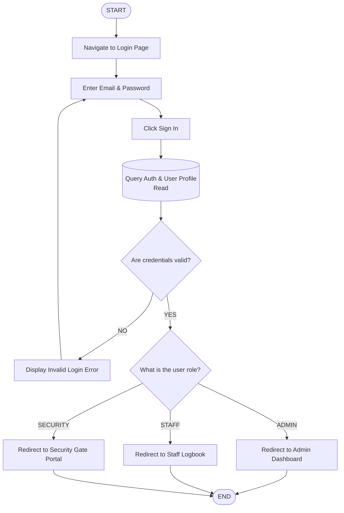

## Low-Level (Technical)
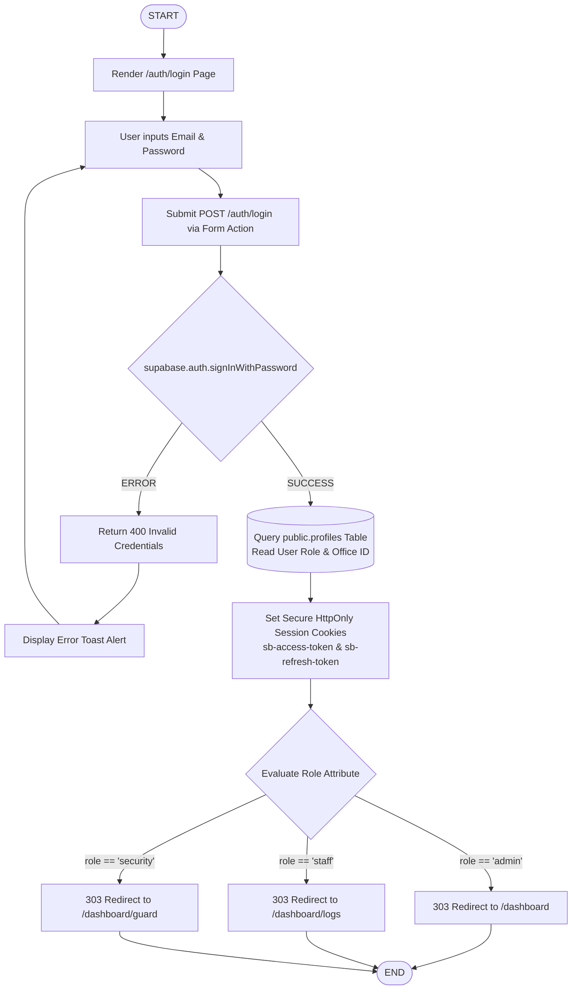

---

# 2. Activity Diagram of User Updating Profile & Credentials

## High-Level (Simplified)
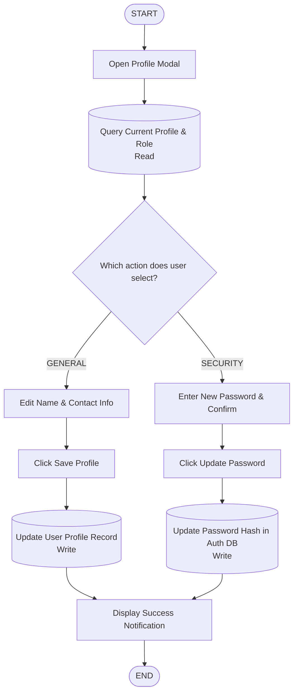

## Low-Level (Technical)
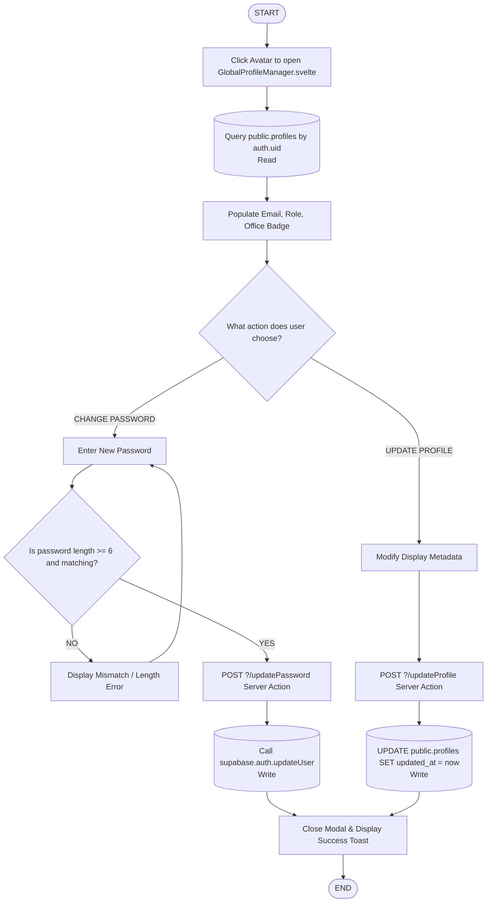

---

# 3. Activity Diagram of Admin Managing User Accounts

## High-Level (Simplified)
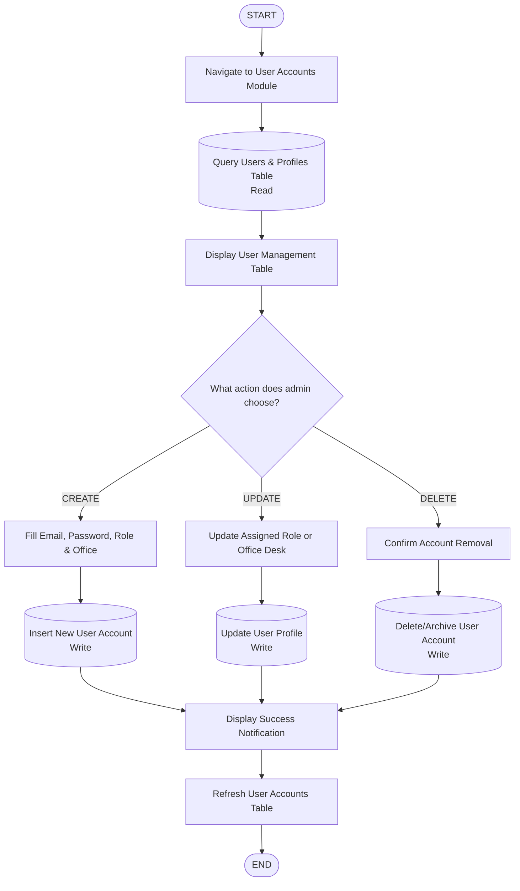

## Low-Level (Technical)
```mermaid
flowchart TD
    START([START]) --> RequestUsersPage[GET /dashboard/admin/users]
    RequestUsersPage --> QueryProfilesAndOffices[(Query public.profiles JOIN public.offices<br/>Read)]
    QueryProfilesAndOffices --> RenderUsersTable[Render User Accounts Table with Role Badges]
    
    RenderUsersTable --> AdminActionChoice{Select User Operation}
    
    AdminActionChoice -->|ADD USER| OpenAddDialog[Open Create User Modal]
    AdminActionChoice -->|EDIT USER| OpenEditDialog[Open Edit Role & Office Modal]
    AdminActionChoice -->|DELETE USER| OpenDeleteDialog[Open Delete Confirmation Modal]
    
    OpenAddDialog --> SubmitCreate[POST ?/createUser { email, password, role, officeId }]
    OpenEditDialog --> SubmitUpdate[POST ?/updateUser { userId, role, officeId }]
    OpenDeleteDialog --> SubmitDelete[POST ?/deleteUser { userId }]
    
    SubmitCreate --> CallServiceCreate[(Call auth.admin.createUser<br/>Write)]
    CallServiceCreate --> TriggerProfileSync[(Trigger on_auth_user_created<br/>Write to public.profiles)]
    
    SubmitUpdate --> DirectProfileUpdate[(UPDATE public.profiles SET role, office_id<br/>Write)]
    SubmitDelete --> CallServiceDelete[(Call auth.admin.deleteUser<br/>Write)]
    
    TriggerProfileSync --> InvalidateData[Invalidate SvelteKit Load Cache]
    DirectProfileUpdate --> InvalidateData
    CallServiceDelete --> InvalidateData
    
    InvalidateData --> ShowToastNotification[Display Operation Success Toast]
    ShowToastNotification --> END([END])
```

---

# 4. Activity Diagram of 3-Step Visitor Gate Check-In Wizard

## High-Level (Simplified)

### Part A: Personal Details & Live Photo
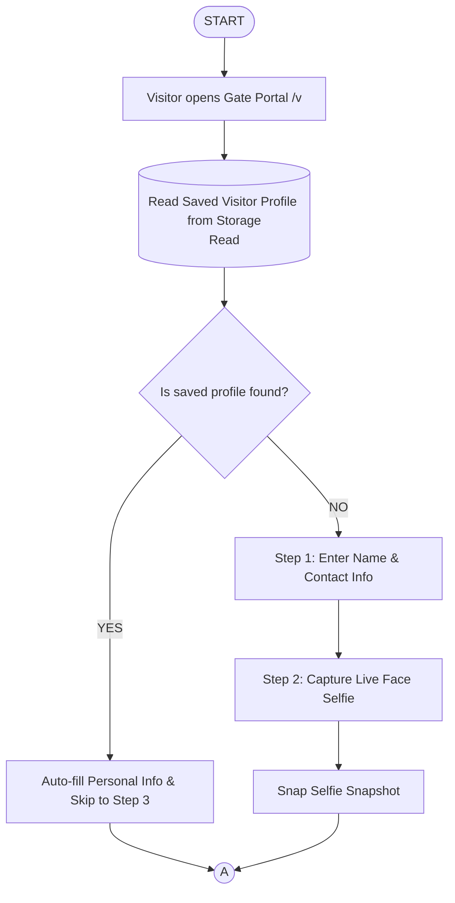

### Part B: Destination Selection & Pass Generation
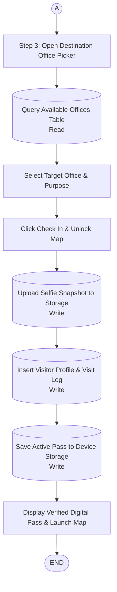

## Low-Level (Technical)

### Part A: Personal Details & Webcam Snapshot
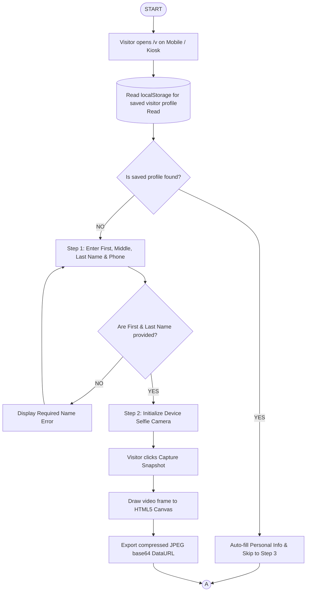

### Part B: Office Selection, Pass Generation & Map Unlock
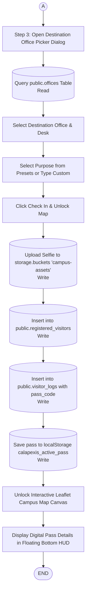

---

# 5. Activity Diagram of Google Authentication & Profile Auto-Fill

## High-Level (Simplified)
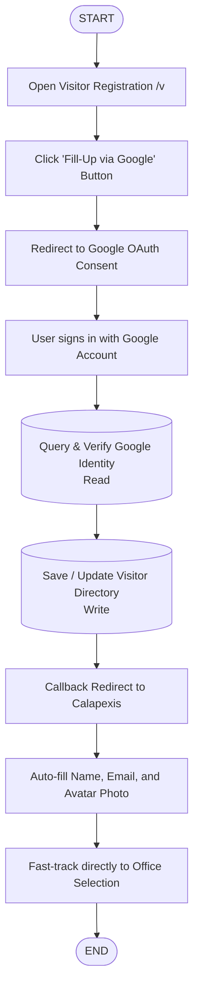

## Low-Level (Technical)
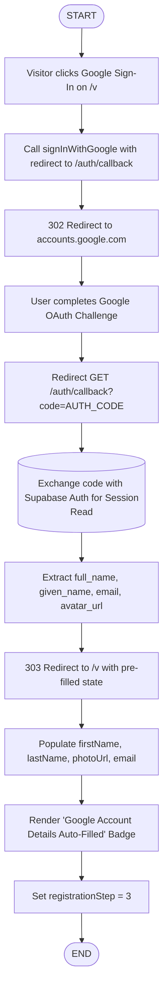

---

# 6. Activity Diagram of Security Gate Pass Verification

## High-Level (Simplified)
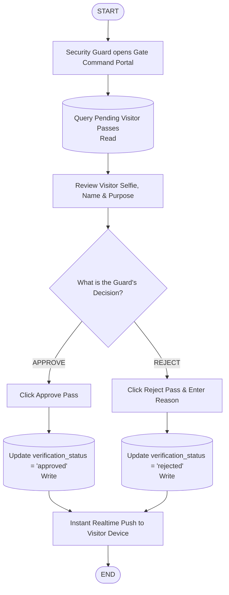

## Low-Level (Technical)
```mermaid
flowchart TD
    START([START]) --> MountGuardDashboard[GET /dashboard/guard]
    MountGuardDashboard --> SubscribeRealtime[(Subscribe to supabase_realtime public.visitor_logs<br/>Read)]
    SubscribeRealtime --> RenderPendingStream[Render stream of passes where verification_status == 'pending']
    
    RenderPendingStream --> GuardActionSelect{Guard Action}
    
    GuardActionSelect -->|APPROVE| SubmitApprove[POST ?/approvePass { logId }]
    GuardActionSelect -->|REJECT| FillRejectReason[Input specific rejection notes in Dialog]
    
    FillRejectReason --> SubmitReject[POST ?/rejectPass { logId, reason }]
    
    SubmitApprove --> ExecDbApprove[(UPDATE public.visitor_logs SET verification_status = 'approved'<br/>Write)]
    SubmitReject --> ExecDbReject[(UPDATE public.visitor_logs SET verification_status = 'rejected', rejection_reason = reason<br/>Write)]
    
    ExecDbApprove --> BroadcastCdcEvent[Postgres triggers Realtime CDC broadcast]
    ExecDbReject --> BroadcastCdcEvent
    
    BroadcastCdcEvent --> VisitorDeviceSync[Visitor WebSocket receives updated payload]
    
    VisitorDeviceSync --> CheckApprovedStatus{Is pass approved?}
    CheckApprovedStatus -->|YES| RenderVerifiedHUD[Switch Visitor UI to Verified Pass & GPS Navigation]
    CheckApprovedStatus -->|NO| RenderDeclinedCard[Display 'Pass Declined' Screen with Reason]
    
    RenderVerifiedHUD --> END([END])
    RenderDeclinedCard --> END
```

---

# 7. Activity Diagram of Office Desk QR Code Scanning & Check-In

## High-Level (Simplified)
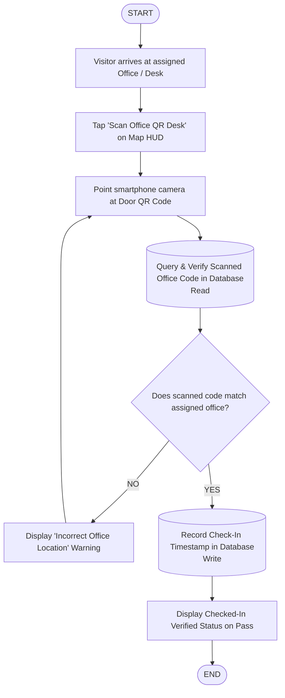

## Low-Level (Technical)
```mermaid
flowchart TD
    START([START]) --> ClickScanHudButton[Visitor clicks 'Scan Office QR Desk' in /v HUD]
    ClickScanHudButton --> MountHtml5Qrcode[Initialize Html5QrcodeInstance with facingMode: 'environment']
    MountHtml5Qrcode --> StreamVideoFeed[Stream live 10fps camera frames]
    
    StreamVideoFeed --> InputModeChoice{How is office code acquired?}
    
    InputModeChoice -->|QR SCAN| DecodeQrFrame[Html5Qrcode decodes text payload: 'OFF-CCS']
    InputModeChoice -->|MANUAL ENTRY| TypeManualCode[User enters code in manual fallback input]
    
    DecodeQrFrame --> ValidateDeskCode[Execute validateScannedOfficeCode]
    TypeManualCode --> ValidateDeskCode
    
    ValidateDeskCode --> VerifyOfficeMatch{Does code match prePassData.officeId / officeCode?}
    
    VerifyOfficeMatch -->|MISMATCH| TriggerAlertBanner[Display Destructive Alert 'Mismatched Office Location']
    TriggerAlertBanner --> StreamVideoFeed
    
    VerifyOfficeMatch -->|MATCH| SubmitCheckInAction[Submit POST ?/checkIn { logId, officeCode }]
    SubmitCheckInAction --> VerifyOfficeActive[(SELECT id FROM public.offices WHERE code = 'OFF-CCS'<br/>Read)]
    
    VerifyOfficeActive --> UpdateLogRecord[(UPDATE public.visitor_logs SET status = 'checked_in', check_in_time = now<br/>Write)]
    
    UpdateLogRecord --> StopCameraService[qrScannerInstance.stop & qrScannerInstance.clear]
    StopCameraService --> CloseModal[Close Scanner Dialog]
    CloseModal --> SetOfficialPassState[Update activeOfficialPass state in Browser]
    SetOfficialPassState --> RenderActiveHudBadge[Render green 'CHECKED IN' Badge on HUD]
    RenderActiveHudBadge --> END([END])
```

---

# 8. Activity Diagram of Visitor Check-Out Process (Manual & Scheduled)

## High-Level (Simplified)
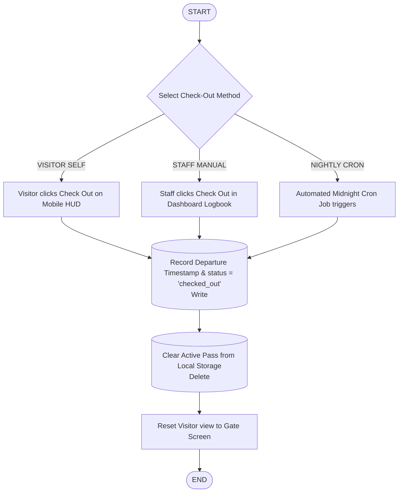

## Low-Level (Technical)
```mermaid
flowchart TD
    START([START]) --> IdentifyTriggerSource{Identify Trigger Source}
    
    IdentifyTriggerSource -->|CLIENT SELF-ACTION| UserSelfClick[Visitor clicks Check Out in /v HUD]
    IdentifyTriggerSource -->|STAFF DESK ACTION| StaffClickRow[Staff clicks Check Out row in /dashboard/logs]
    IdentifyTriggerSource -->|PG_CRON ROUTINE| PgCronTrigger[pg_cron fires at 23:59 UTC nightly]
    
    UserSelfClick --> PostSelfCheckout[POST ?/checkout { logId }]
    StaffClickRow --> PostStaffCheckout[POST ?/checkout { logId }]
    PgCronTrigger --> InvokeSqlProcedure[Invoke public.auto_checkout_unresolved_visitors]
    
    PostSelfCheckout --> ExecSingleUpdate[(UPDATE public.visitor_logs SET status = 'checked_out', check_out_time = now WHERE id = logId<br/>Write)]
    PostStaffCheckout --> ExecSingleUpdate
    InvokeSqlProcedure --> ExecBulkUpdate[(UPDATE public.visitor_logs SET status = 'checked_out', check_out_time = now WHERE status = 'checked_in'<br/>Write)]
    
    ExecSingleUpdate --> BroadcastCheckoutEvent[Supabase Realtime broadcasts postgres_changes event]
    ExecBulkUpdate --> BroadcastCheckoutEvent
    
    BroadcastCheckoutEvent --> ClientSyncReceiver[Browser client receives checkout notification]
    ClientSyncReceiver --> RemoveLocalStorage[(localStorage.removeItem 'calapexis_active_pass'<br/>Delete)]
    
    RemoveLocalStorage --> ResetReactivePassState[Set activeOfficialPass = null and prePassData = null]
    ResetReactivePassState --> OpenGateOverlayModal[Re-open Fullscreen Gate Check-In Overlay]
    OpenGateOverlayModal --> END([END])
```

---

# 9. Activity Diagram of Campus Map Pathfinding & GPS Routing

## High-Level (Simplified)

### Part A: Destination & GPS Acquisition
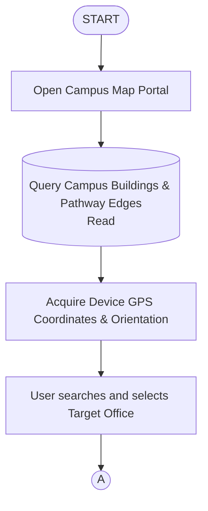

### Part B: Route Computation & Navigation
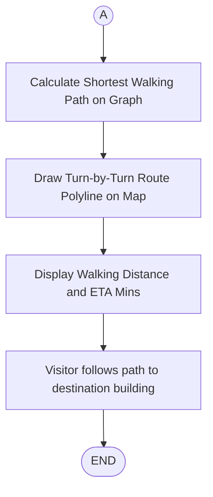

## Low-Level (Technical)

### Part A: Destination Selection & Hardware GPS Positioning
```mermaid
flowchart TD
    START([START]) --> MountMapCanvas[Initialize Leaflet Map Canvas on /v]
    MountMapCanvas --> LoadMapEdges[(Query public.map_edges Table<br/>Read)]
    LoadMapEdges --> ConstructGraph[Build adjacency graph data structure]
    
    MountMapCanvas --> RequestGpsPermission{Is GPS permission granted?}
    
    RequestGpsPermission -->|YES| WatchGpsPosition[navigator.geolocation.watchPosition]
    WatchGpsPosition --> RenderGpsMarker[Render pulsing blue user location marker on map]
    
    RequestGpsPermission -->|NO| UseGateDefaultCoords[Fallback to Campus Main Gate Coordinates]
    UseGateDefaultCoords --> RenderGpsMarker
    
    RenderGpsMarker --> ListenCompassOrientation[window.addEventListener 'deviceorientation']
    ListenCompassOrientation --> RotateCompassHeading[Rotate directional heading bearing icon]
    
    RotateCompassHeading --> UserSelectsDestination[User searches or selects target Office / Building]
    UserSelectsDestination --> ConnA((A))
```

### Part B: Dijkstra Pathfinding & Turn-by-Turn Waypoint Rendering
```mermaid
flowchart TD
    ConnA((A)) --> ExecuteDijkstraAlgorithm[Run Dijkstra shortest path algorithm on graph]
    ExecuteDijkstraAlgorithm --> FindNearestEntryNode[Find closest map vertex to user coordinates]
    
    FindNearestEntryNode --> ComputePrimaryAndAltPaths[Calculate Primary and Alternative Path Points]
    ComputePrimaryAndAltPaths --> CalculateMetersAndETA[Compute total distance in meters and walking ETA]
    
    CalculateMetersAndETA --> DrawLeafletPolyline[Draw L.polyline with #2563eb on Leaflet canvas]
    DrawLeafletPolyline --> RenderFloatingPillHUD[Display Floating Navigation Pill Bar with Footsteps & Clock]
    
    RenderFloatingPillHUD --> VisitorWalksRoute[Visitor follows polyline walking path across campus]
    VisitorWalksRoute --> ArriveAtTargetLandmark[Visitor reaches destination building]
    ArriveAtTargetLandmark --> END([END])
```

---

# 10. Activity Diagram of Campus Infrastructure Management (Buildings, Rooms, Offices)

## High-Level (Simplified)
```mermaid
flowchart TD
    START([START]) --> OpenInfraPortal[Admin opens Campus Infrastructure Portal]
    OpenInfraPortal --> FetchInfraData[(Query Buildings, Rooms & Offices Table<br/>Read)]
    FetchInfraData --> SelectCategory{Which entity does admin manage?}
    
    SelectCategory -->|BUILDINGS| ManageBuildings[Add / Edit Building Details & Landmark Photo]
    SelectCategory -->|ROOMS| ManageRooms[Add / Edit Room Number, Name & Floor Level]
    SelectCategory -->|OFFICES| ManageOffices[Add / Edit Department Office & Desk Binding]
    
    ManageBuildings --> CommitChanges[(Save to Supabase Database & Storage<br/>Write)]
    ManageRooms --> CommitChanges
    ManageOffices --> CommitChanges
    
    CommitChanges --> RefreshMapMarkers[Refresh Real-Time Campus Map Landmarks]
    RefreshMapMarkers --> END([END])
```

## Low-Level (Technical)
```mermaid
flowchart TD
    START([START]) --> RequestBuildingsPage[GET /dashboard/admin/buildings]
    RequestBuildingsPage --> QueryAllInfra[(Query public.buildings, public.rooms, public.offices<br/>Read)]
    QueryAllInfra --> RenderManagementTabs[Render Buildings Grid, Rooms Table, Offices Table]
    
    RenderManagementTabs --> SelectAdminAction{Select Form Operation}
    
    SelectAdminAction -->|UPSERT BUILDING| OpenBuildingModal[Open Building Modal Form]
    SelectAdminAction -->|UPSERT ROOM| OpenRoomModal[Open Room Modal Form]
    SelectAdminAction -->|UPSERT OFFICE| OpenOfficeModal[Open Office Modal Form]
    
    OpenBuildingModal --> CheckImageProvided{Is landmark image file uploaded?}
    CheckImageProvided -->|YES| UploadImageStorage[(Upload file to storage.buckets 'campus-assets'<br/>Write)]
    CheckImageProvided -->|NO| SkipImageUpload[Retain existing image_url]
    
    UploadImageStorage --> SubmitBuildingAction[POST ?/upsertBuilding]
    SkipImageUpload --> SubmitBuildingAction
    
    OpenRoomModal --> SubmitRoomAction[POST ?/upsertRoom]
    OpenOfficeModal --> SubmitOfficeAction[POST ?/upsertOffice]
    
    SubmitBuildingAction --> InsertBuildingDb[(INSERT/UPDATE public.buildings<br/>Write)]
    SubmitRoomAction --> InsertRoomDb[(INSERT/UPDATE public.rooms<br/>Write)]
    SubmitOfficeAction --> InsertOfficeDb[(INSERT/UPDATE public.offices<br/>Write)]
    
    InsertBuildingDb --> InvalidatePageCache[Invalidate SvelteKit Load Functions]
    InsertRoomDb --> InvalidatePageCache
    InsertOfficeDb --> InvalidatePageCache
    
    InvalidatePageCache --> DisplaySuccessNotification[Display Operation Success Toast]
    DisplaySuccessNotification --> END([END])
```

---

# 11. Activity Diagram of Map Edge & Pathway Configuration

## High-Level (Simplified)

### Part A: Node Selection & Pathway Plotting
```mermaid
flowchart TD
    START([START]) --> OpenEdgeEditor[Admin opens Map Edges Editor]
    OpenEdgeEditor --> LoadExistingEdges[(Query Map Edges Table<br/>Read)]
    LoadExistingEdges --> SelectNodes[Select Start Building and End Building]
    SelectNodes --> ClickMapWaypoints[Click on Map to Plot Walking Path Waypoints]
    ClickMapWaypoints --> ConnA((A))
```

### Part B: Vertex Adjustment & Saving
```mermaid
flowchart TD
    ConnA((A)) --> RefineWaypoints[Adjust or Drag Waypoint Vertex Coordinates]
    RefineWaypoints --> ClickSave[Click Save Pathway Edge]
    ClickSave --> WriteEdgeData[(Insert Pathway Edge & Coordinates into Database<br/>Write)]
    WriteEdgeData --> UpdateGraph[Update Real-Time Campus Pathfinding Graph]
    UpdateGraph --> END([END])
```

## Low-Level (Technical)

### Part A: Node Selection & Interactive Waypoint Plotting
```mermaid
flowchart TD
    START([START]) --> OpenEdgeEditor[Admin opens Map Edges Editor /dashboard/admin/edges]
    OpenEdgeEditor --> LoadExistingEdges[(Query public.map_edges Table<br/>Read)]
    LoadExistingEdges --> RenderGraphCanvas[Render existing pathway polylines on Leaflet map]
    
    RenderGraphCanvas --> SelectStartNode[Select From Building start node from Combobox]
    SelectStartNode --> SelectEndNode[Select To Building destination node from Combobox]
    
    SelectEndNode --> ListenMapClickEvents[Enable Leaflet map click listener]
    ListenMapClickEvents --> AdminClicksMap[Admin clicks along campus walkway on map]
    
    AdminClicksMap --> AppendWaypoint[Append lat, lng coordinate to waypoints array]
    AppendWaypoint --> RenderDynamicPolyline[Render dynamic editable polyline with vertex markers]
    RenderDynamicPolyline --> ConnA((A))
```

### Part B: Direct Vertex Drag Adjustment & Database Persistence
```mermaid
flowchart TD
    ConnA((A)) --> VertexAdjustmentChoice{Does admin want to adjust waypoints?}
    
    VertexAdjustmentChoice -->|DRAG VERTEX| DragMarker[Drag vertex marker on map to refine coordinate position]
    VertexAdjustmentChoice -->|DELETE ROW| RemoveWaypoint[Delete specific coordinate row from table]
    VertexAdjustmentChoice -->|NO ADJUSTMENT| ProceedToSave[Proceed directly to save]
    
    DragMarker --> ProceedToSave
    RemoveWaypoint --> ProceedToSave
    
    ProceedToSave --> ClickSaveEdgeButton[Click 'Save Pathway Edge' Button]
    ClickSaveEdgeButton --> SubmitSaveAction[POST ?/saveEdge { from_node, to_node, path: JSON.stringify(waypoints) }]
    
    SubmitSaveAction --> InsertEdgeRecord[(INSERT INTO public.map_edges from_node, to_node, path<br/>Write)]
    InsertEdgeRecord --> RefreshPathfindingGraph[Re-render updated pathfinding network on map]
    RefreshPathfindingGraph --> DisplaySaveToast[Display 'Pathway edge successfully saved' Toast]
    DisplaySaveToast --> END([END])
```

---

# 12. Activity Diagram of Generating & Printing Audit Reports

## High-Level (Simplified)
```mermaid
flowchart TD
    START([START]) --> OpenLogbookView[Admin / Staff opens Visitor Logbook]
    OpenLogbookView --> FetchLogs[(Query Visitor Logs & Registered Profiles<br/>Read)]
    FetchLogs --> ApplyFilters[Apply Search Query, Date Range & Status Filters]
    
    ApplyFilters --> ClickPrintReport[Click 'Print Audit Report' Button]
    ClickPrintReport --> BuildLetterheadDoc[Generate Clean Document with BISU Calape Seal & Letterhead]
    BuildLetterheadDoc --> GroupByDate[Group Records by Date e.g. 'Monday, Aug 20']
    
    GroupByDate --> OpenStandalonePrintWindow[Open Isolated Print Window & Trigger System Print]
    OpenStandalonePrintWindow --> SavePdfOrPrintPaper[Save as PDF Document or Print to Paper]
    SavePdfOrPrintPaper --> END([END])
```

## Low-Level (Technical)
```mermaid
flowchart TD
    START([START]) --> RequestLogsPage[GET /dashboard/logs]
    RequestLogsPage --> ExecuteScopedQuery[(SELECT * FROM public.visitor_logs JOIN public.registered_visitors WHERE office_id = scopedOfficeId<br/>Read)]
    
    ExecuteScopedQuery --> RenderLogbookTable[Render SvelteKit Data Table with Search & Date Filters]
    RenderLogbookTable --> UserFilterInteractions[User filters table by date preset or custom range]
    
    UserFilterInteractions --> TriggerPrintReportClick[User clicks 'Print Audit Report']
    TriggerPrintReportClick --> CallGenerateHTML[Execute generatePrintableReportHTML(filteredVisitors)]
    
    CallGenerateHTML --> SortRecordsByDate[Sort visitor entries chronologically by check_in_time]
    SortRecordsByDate --> GroupRecordsByDateKey[Group records by date string key 'YYYY-MM-DD']
    
    GroupRecordsByDateKey --> FormatDateHeaderBars[Format date bars e.g. '📅 Monday, Aug 20 • X Records']
    FormatDateHeaderBars --> FormatCrossDayCheckouts[Format cross-day check-out times 'Aug 8, 11:00 AM' / 'Still In']
    
    FormatCrossDayCheckouts --> AssembleHtmlDocument[Assemble standalone HTML with BISU Header, Seal, & Print CSS]
    AssembleHtmlDocument --> OpenPopupWindow[const printWin = window.open('', '_blank')]
    
    OpenPopupWindow --> WriteHtmlStream[printWin.document.write(printableHTML)]
    WriteHtmlStream --> CloseDocumentStream[printWin.document.close]
    
    CloseDocumentStream --> TriggerNativePrint[printWin.print()]
    TriggerNativePrint --> OpenSystemPrintDialog[Browser opens native Print Preview / Save as PDF Dialog]
    OpenSystemPrintDialog --> END([END])
```
