# Calapexis System Sequence Diagrams

This document contains **Sequence Diagrams** detailing message passing, asynchronous RPC calls, server actions, and database transactions for the **Calapexis Campus Visitor Management & Navigation System**. Each section includes both a **High-Level (Simplified)** diagram and a **Low-Level (Technical)** diagram formatted for [mermaid.live](https://mermaid.live/).

---

# 1. Sequence Diagram of User Login Authentication & Session Storage

## High-Level (Simplified)
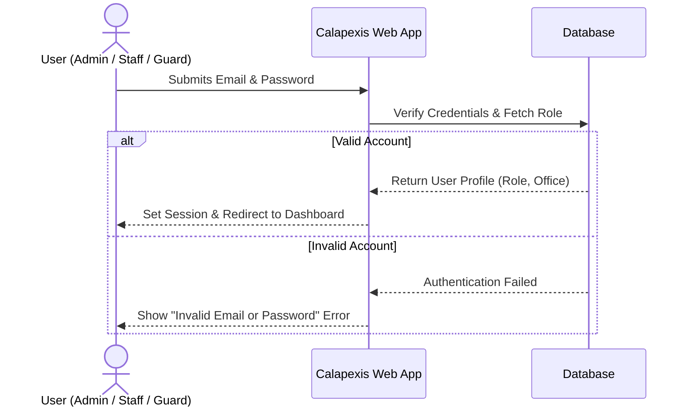

## Low-Level (Technical)
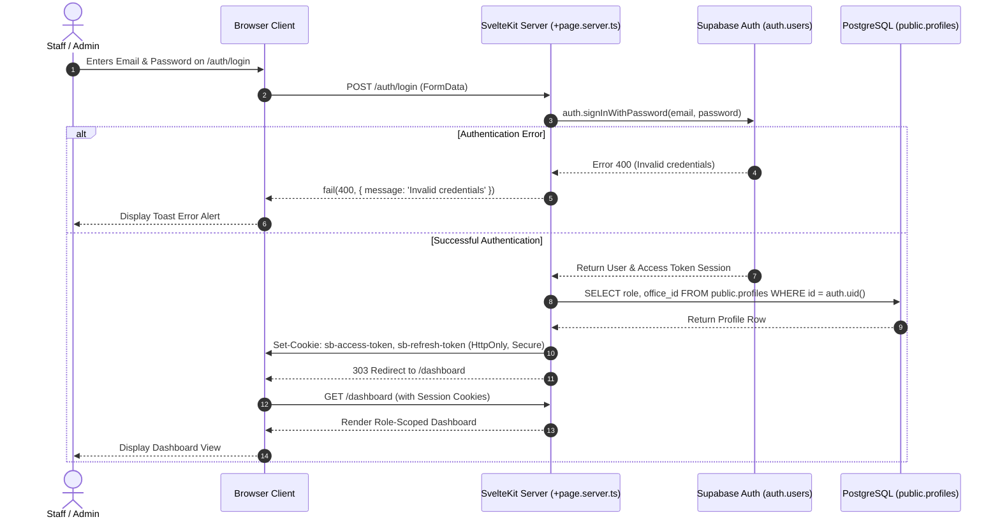

---

# 2. Sequence Diagram of User Profile Update & Password Change

## High-Level (Simplified)
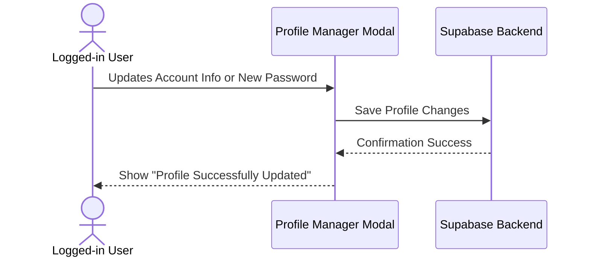

## Low-Level (Technical)
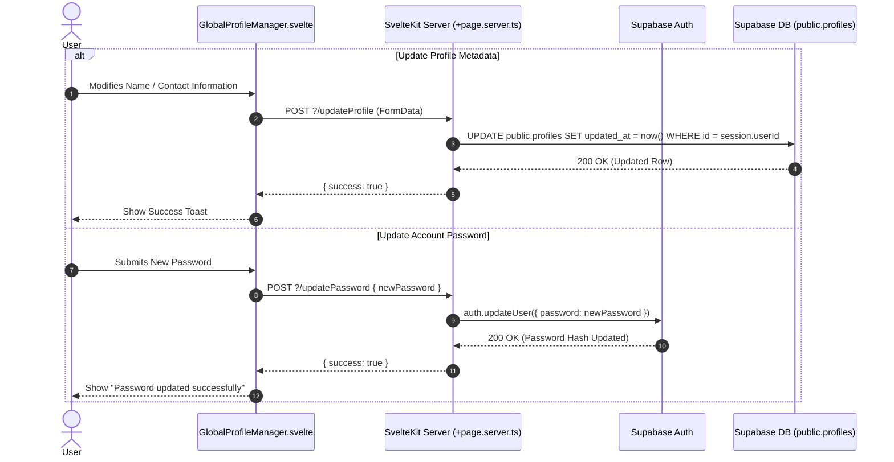

---

# 3. Sequence Diagram of Admin Provisioning New Users & Roles

## High-Level (Simplified)
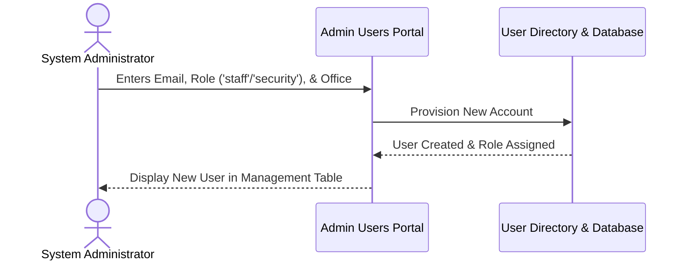

## Low-Level (Technical)
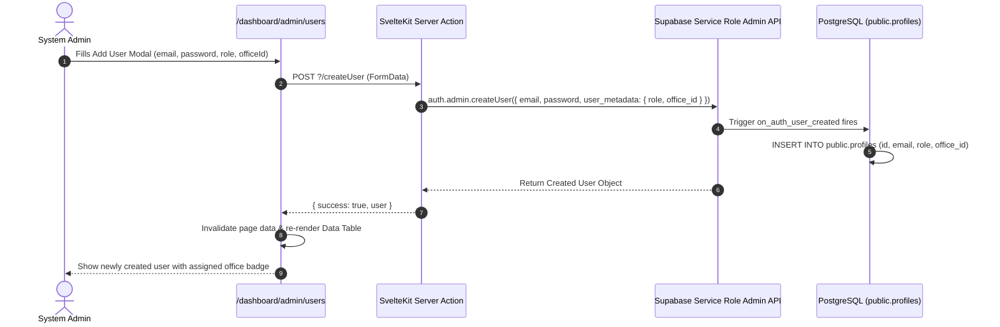

---

# 4. Sequence Diagram of Visitor Gate Registration & Snapshot Upload

## High-Level (Simplified)
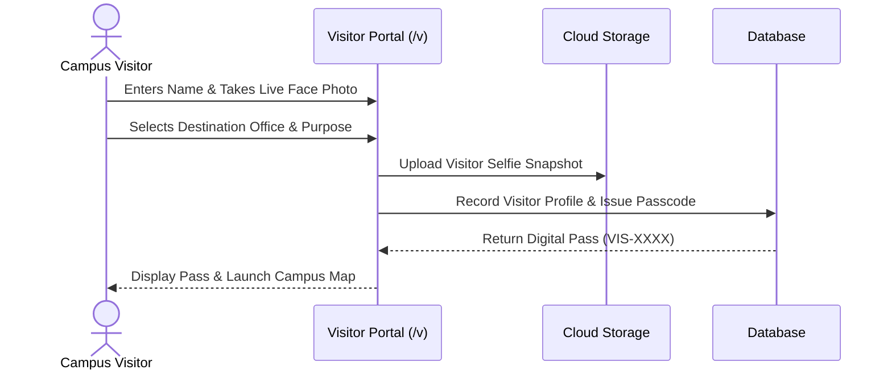

## Low-Level (Technical)
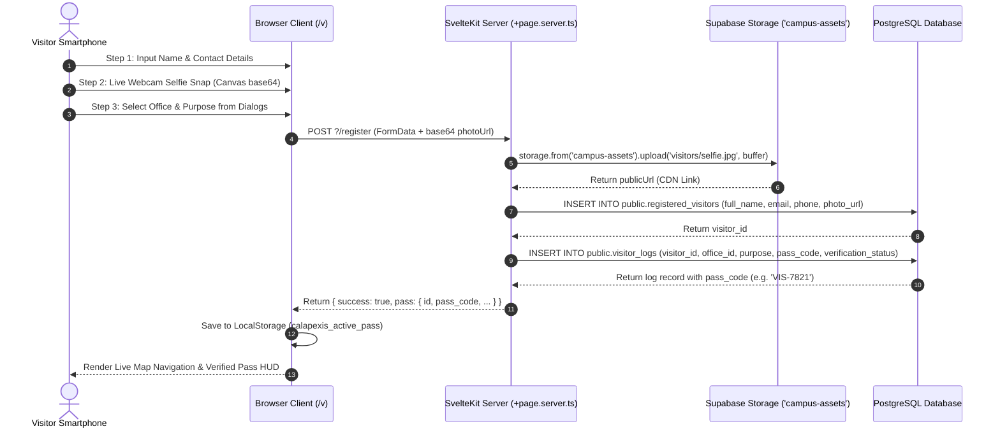

---

# 5. Sequence Diagram of Google OAuth Auto-Fill Registration

## High-Level (Simplified)
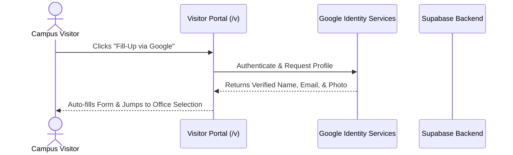

## Low-Level (Technical)
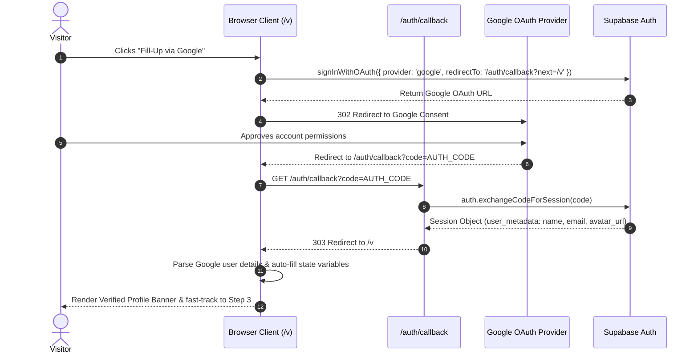

---

# 6. Sequence Diagram of Real-Time Security Pass Approval / Rejection

## High-Level (Simplified)
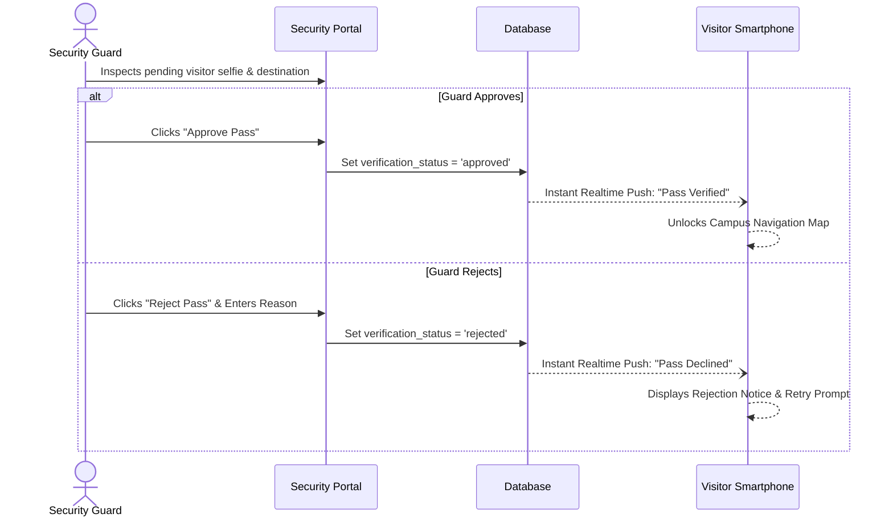

## Low-Level (Technical)
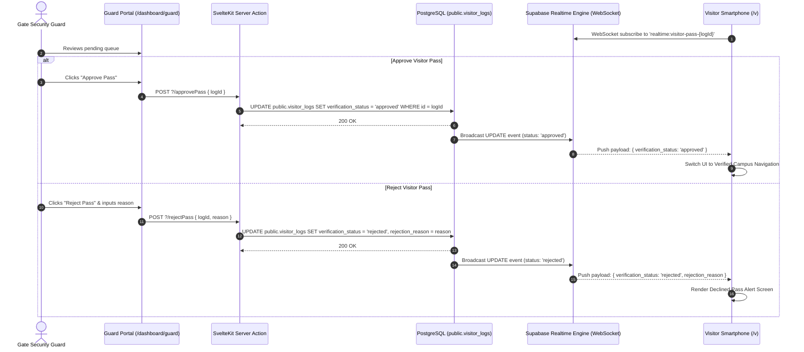

---

# 7. Sequence Diagram of Office Desk QR Code Verification & Check-In

## High-Level (Simplified)
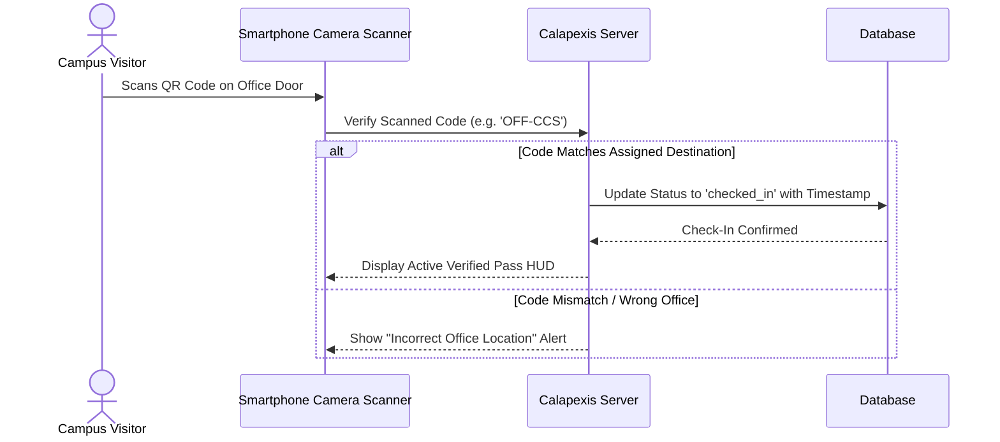

## Low-Level (Technical)
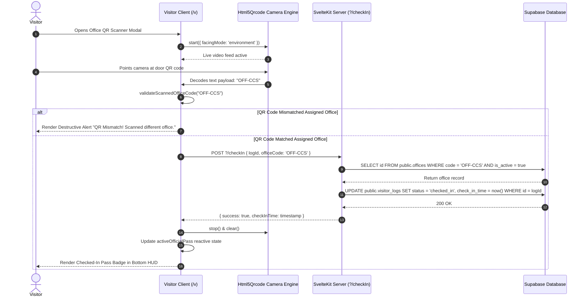

---

# 8. Sequence Diagram of Visitor Check-Out & Session Resolution

## High-Level (Simplified)
```mermaid
sequenceDiagram
    actor Actor as Visitor / Staff / Auto-Cron
    participant App as Calapexis Application
    participant DB as Database

    Actor->>App: Trigger Check-Out
    App->>DB: Stamp Departure Time & Set status = 'checked_out'
    DB-->>App: Session Resolved
    App-->>Actor: Clear Pass & Archive Visitor Record
```

## Low-Level (Technical)
```mermaid
sequenceDiagram
    autonumber
    actor Actor as Visitor / Staff Member
    participant Browser as Browser Client
    participant Server as SvelteKit Server Action
    participant SupaDB as PostgreSQL (public.visitor_logs)
    participant Realtime as Supabase Realtime Channel

    Actor->>Browser: Clicks "Check Out" Button
    Browser->>Server: POST ?/checkout { logId }
    
    Server->>SupaDB: UPDATE public.visitor_logs SET status = 'checked_out', check_out_time = now() WHERE id = logId
    SupaDB-->>Server: 200 OK (Updated Row)
    
    SupaDB->>Realtime: Broadcast postgres_changes UPDATE (status = 'checked_out')
    
    Server-->>Browser: { success: true }
    Browser->>Browser: localStorage.removeItem('calapexis_active_pass')
    Browser->>Browser: Reset UI state to Gate Registration Overlay
    Browser-->>Actor: Display Check-Out Confirmation Toast
```

---

# 9. Sequence Diagram of Dijkstra Campus Pathfinding & GPS Navigation

## High-Level (Simplified)
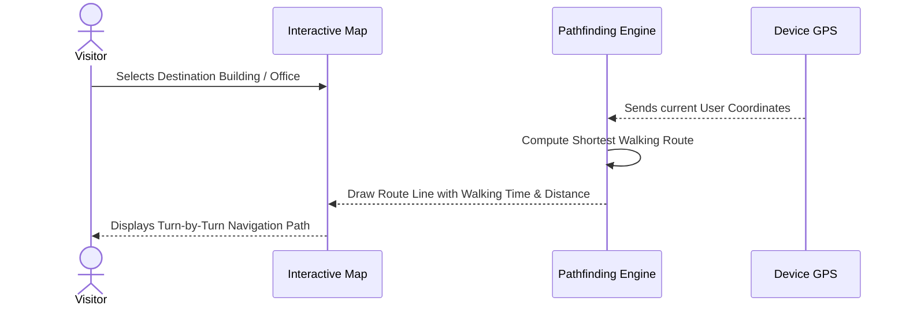

## Low-Level (Technical)
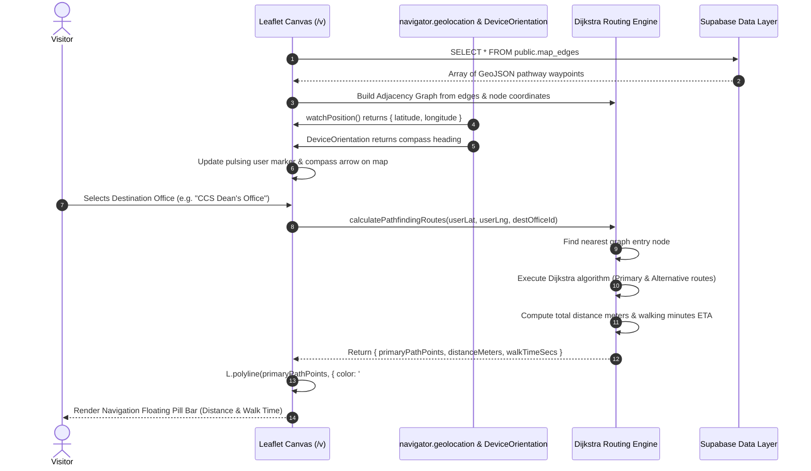

---

# 10. Sequence Diagram of Campus Infrastructure Management & Asset Storage

## High-Level (Simplified)
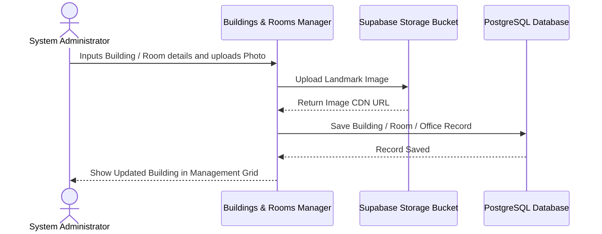

## Low-Level (Technical)
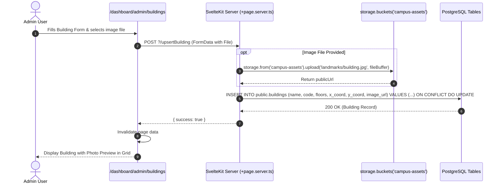

---

# 11. Sequence Diagram of Interactive Map Graph Edge Authoring

## High-Level (Simplified)
```mermaid
sequenceDiagram
    actor Admin as Administrator
    participant MapUI as Visual Edge Canvas
    participant DB as PostgreSQL Database

    Admin->>MapUI: Selects From Node & To Node
    Admin->>MapUI: Clicks along campus walkway to plot waypoints
    Admin->>MapUI: Clicks "Save Pathway Edge"
    MapUI->>DB: Insert Graph Edge & GeoJSON coordinates
    DB-->>MapUI: Edge Saved Successfully
    MapUI-->>Admin: Display Pathfinding Line on Map
```

## Low-Level (Technical)
```mermaid
sequenceDiagram
    autonumber
    actor Admin as Admin
    participant Browser as /dashboard/admin/edges
    participant Leaflet as Leaflet Map Canvas
    participant Server as SvelteKit Server Action
    participant SupaDB as PostgreSQL (public.map_edges)

    Admin->>Browser: Selects from_node (Building 1) & to_node (Building 2)
    Admin->>Leaflet: Clicks on map to add pathway points
    Leaflet->>Browser: Captures click event { latlng: { lat, lng } }
    Browser->>Browser: Append to waypoints array & render interactive vertex markers
    
    opt Direct Drag Adjustment
        Admin->>Leaflet: Drags vertex marker to refine coordinate
        Leaflet->>Browser: Updates waypoint index coordinate in state
    end
    
    Admin->>Browser: Clicks "Save Pathway Edge"
    Browser->>Server: POST ?/saveEdge { from_node, to_node, path: JSON.stringify(waypoints) }
    
    Server->>SupaDB: INSERT INTO public.map_edges (from_node, to_node, path) VALUES ($1, $2, $3::jsonb)
    SupaDB-->>Server: 200 OK
    
    Server-->>Browser: { success: true }
    Browser->>Leaflet: Render permanent edge polyline on graph canvas
    Browser-->>Admin: Show Success Toast "Pathway edge saved"
```

---

# 12. Sequence Diagram of Standalone Print Audit Report Engine

## High-Level (Simplified)
```mermaid
sequenceDiagram
    actor User as Admin / Staff User
    participant Logbook as Logbook Dashboard
    participant PrintEngine as Standalone Print Window
    participant Printer as System Print / PDF Dialog

    User->>Logbook: Filters records and clicks "Print Audit Report"
    Logbook->>PrintEngine: Generate HTML Letterhead & Date Groups
    PrintEngine->>PrintEngine: Open isolated popup window
    PrintEngine->>Printer: Trigger window.print()
    Printer-->>User: Outputs Official PDF / Paper Audit Report
```

## Low-Level (Technical)
```mermaid
sequenceDiagram
    autonumber
    actor User as Admin / Staff
    participant Browser as /dashboard/logs
    participant Generator as generatePrintableReportHTML()
    participant Popup as Standalone Window (window.open)
    participant SystemPrint as Native Browser Print Service

    User->>Browser: Selects Date Range & Clicks "Print Audit Report"
    Browser->>Generator: Passes filteredVisitorList data
    
    Generator->>Generator: Sort & Group records by Date (e.g. '2026-08-20')
    Generator->>Generator: Format Date Header Bars ('Monday, Aug 20')
    Generator->>Generator: Format Cross-Day Check-Out timestamps
    Generator->>Generator: Inject BISU Campus Seal, Letterhead, & Table CSS
    
    Generator-->>Browser: Return complete self-contained HTML document string
    
    Browser->>Popup: const printWin = window.open('', '_blank')
    Browser->>Popup: printWin.document.write(printableHTML)
    Browser->>Popup: printWin.document.close()
    
    Popup->>SystemPrint: printWin.print()
    SystemPrint-->>User: Open Print Preview / Save as PDF Dialog
```
