# Calapexis System Use Case Diagrams

This document contains a comprehensive suite of **26 Use Case Diagrams** representing all business processes, administrative features, visitor flows, and technical operations of the **Calapexis Campus Visitor Management & Navigation System**.

Each diagram follows the standardized FontAwesome icon actor UML Use Case presentation style:
- **Actor (Left Side)**: Icon Node (`Actor@{ icon: "fa-person", label: "Actor Name" }`).
- **Use Cases (Right Side)**: Vertical stack of oval / stadium process bubbles (`P1(["Process Name"])`).
- **Associations**: Clean directed connection arrows linking the actor on the left to each associated process bubble.
- **Variants**: Both **High-Level (Simplified)** and **Low-Level (Technical)** versions are provided for every process.

---

# Module 1: Authentication & Access Control

## 1. Use Case Diagram of User Login Authentication

### High-Level (Simplified)
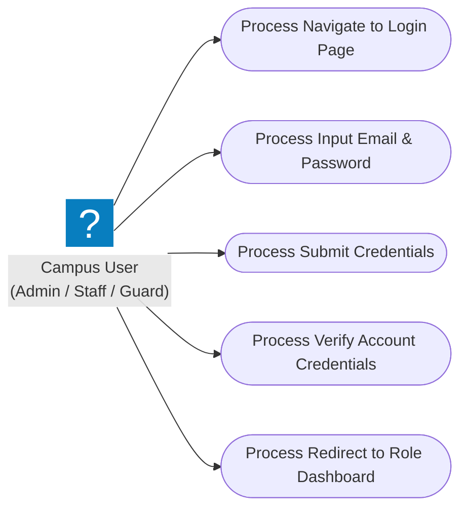
```mermaid
flowchart LR
    User@{ icon: "fa-person", label: "Campus User\n(Admin / Staff / Guard)" }
    
    P1(["Process Navigate to Login Page"])
    P2(["Process Input Email & Password"])
    P3(["Process Submit Credentials"])
    P4(["Process Verify Account Credentials"])
    P5(["Process Redirect to Role Dashboard"])

    User --> P1
    User --> P2
    User --> P3
    User --> P4
    User --> P5
```

### Low-Level (Technical)
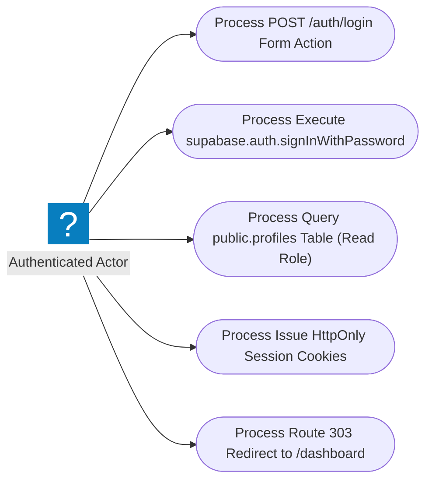
```mermaid
flowchart LR
    User@{ icon: "fa-person", label: "Authenticated Actor" }

    P1(["Process POST /auth/login Form Action"])
    P2(["Process Execute supabase.auth.signInWithPassword"])
    P3(["Process Query public.profiles Table (Read Role)"])
    P4(["Process Issue HttpOnly Session Cookies"])
    P5(["Process Route 303 Redirect to /dashboard"])

    User --> P1
    User --> P2
    User --> P3
    User --> P4
    User --> P5
```

---

## 2. Use Case Diagram of Password Reset & Account Security

### High-Level (Simplified)
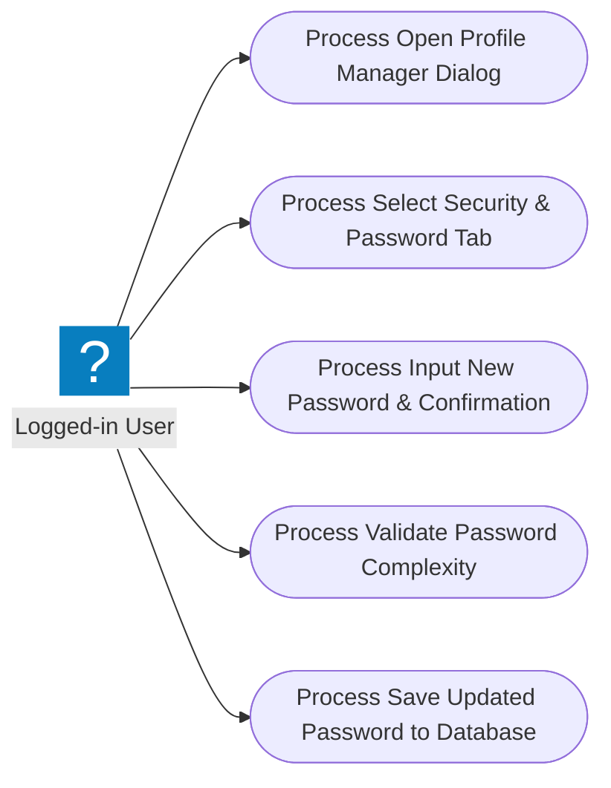
```mermaid
flowchart LR
    User@{ icon: "fa-person", label: "Logged-in User" }

    P1(["Process Open Profile Manager Dialog"])
    P2(["Process Select Security & Password Tab"])
    P3(["Process Input New Password & Confirmation"])
    P4(["Process Validate Password Complexity"])
    P5(["Process Save Updated Password to Database"])

    User --> P1
    User --> P2
    User --> P3
    User --> P4
    User --> P5
```

### Low-Level (Technical)
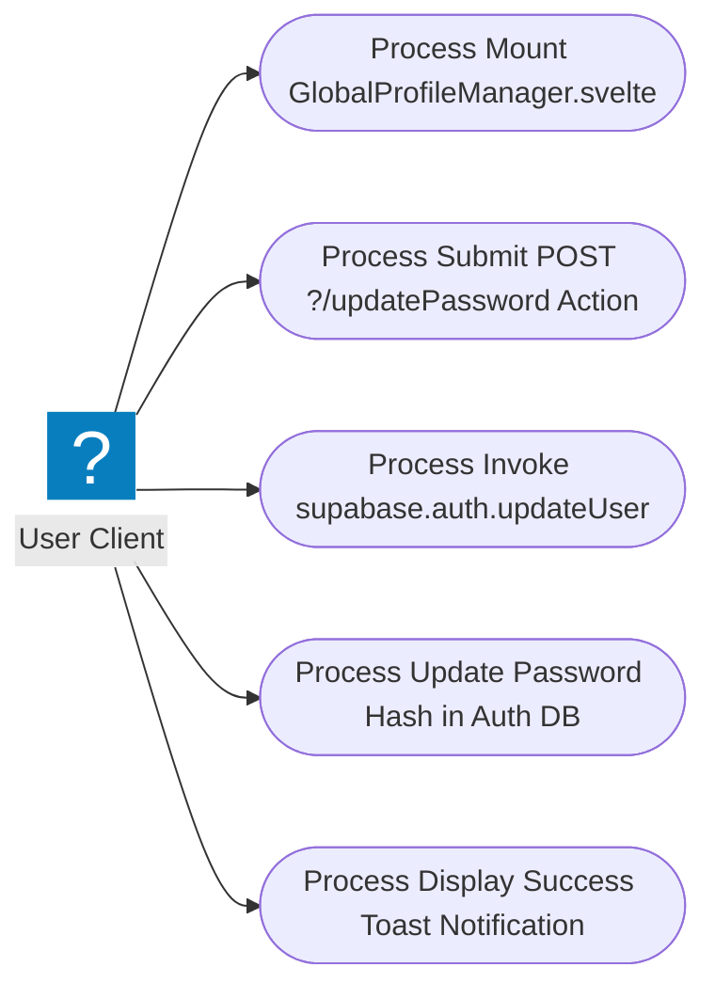
```mermaid
flowchart LR
    User@{ icon: "fa-person", label: "User Client" }

    P1(["Process Mount GlobalProfileManager.svelte"])
    P2(["Process Submit POST ?/updatePassword Action"])
    P3(["Process Invoke supabase.auth.updateUser"])
    P4(["Process Update Password Hash in Auth DB"])
    P5(["Process Display Success Toast Notification"])

    User --> P1
    User --> P2
    User --> P3
    User --> P4
    User --> P5
```

---

## 3. Use Case Diagram of Updating User Profile Information

### High-Level (Simplified)
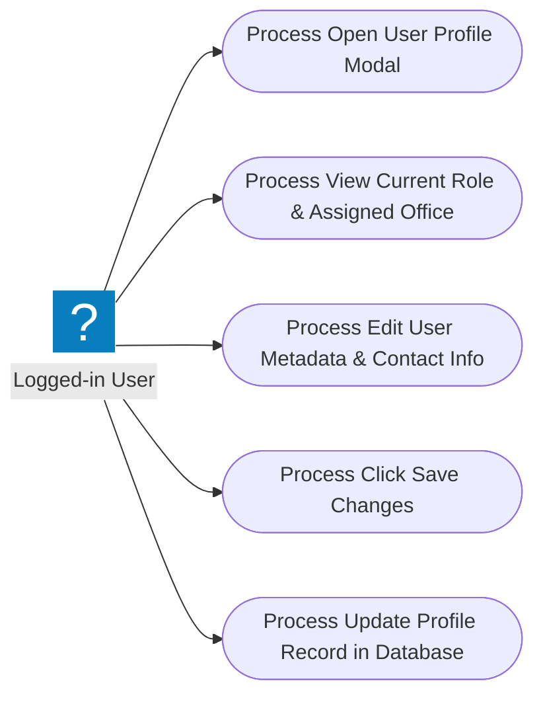
```mermaid
flowchart LR
    User@{ icon: "fa-person", label: "Logged-in User" }

    P1(["Process Open User Profile Modal"])
    P2(["Process View Current Role & Assigned Office"])
    P3(["Process Edit User Metadata & Contact Info"])
    P4(["Process Click Save Changes"])
    P5(["Process Update Profile Record in Database"])

    User --> P1
    User --> P2
    User --> P3
    User --> P4
    User --> P5
```

### Low-Level (Technical)
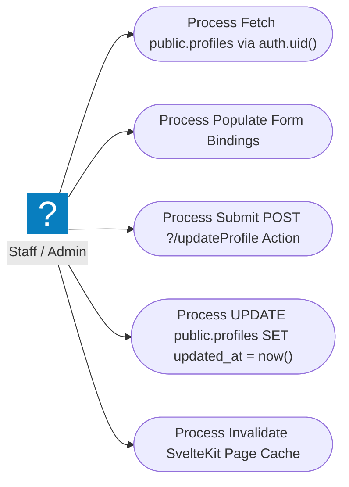
```mermaid
flowchart LR
    User@{ icon: "fa-person", label: "Staff / Admin" }

    P1(["Process Fetch public.profiles via auth.uid()"])
    P2(["Process Populate Form Bindings"])
    P3(["Process Submit POST ?/updateProfile Action"])
    P4(["Process UPDATE public.profiles SET updated_at = now()"])
    P5(["Process Invalidate SvelteKit Page Cache"])

    User --> P1
    User --> P2
    User --> P3
    User --> P4
    User --> P5
```

---

## 4. Use Case Diagram of Role-Based Navigation & Dashboard Routing

### High-Level (Simplified)
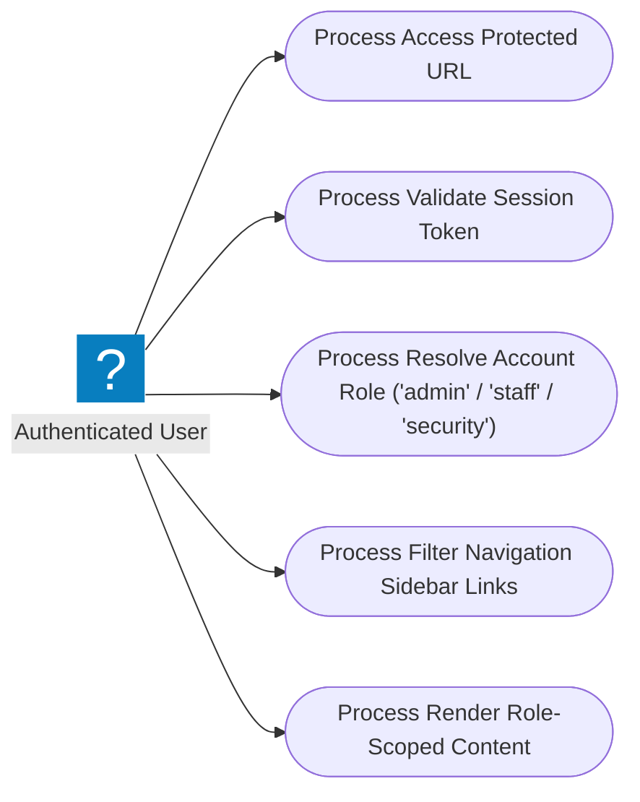
```mermaid
flowchart LR
    User@{ icon: "fa-person", label: "Authenticated User" }

    P1(["Process Access Protected URL"])
    P2(["Process Validate Session Token"])
    P3(["Process Resolve Account Role ('admin' / 'staff' / 'security')"])
    P4(["Process Filter Navigation Sidebar Links"])
    P5(["Process Render Role-Scoped Content"])

    User --> P1
    User --> P2
    User --> P3
    User --> P4
    User --> P5
```

### Low-Level (Technical)
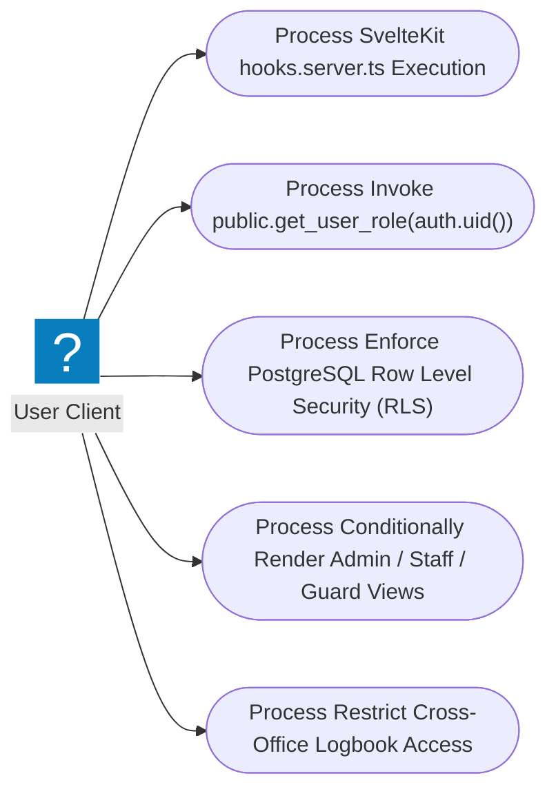
```mermaid
flowchart LR
    User@{ icon: "fa-person", label: "User Client" }

    P1(["Process SvelteKit hooks.server.ts Execution"])
    P2(["Process Invoke public.get_user_role(auth.uid())"])
    P3(["Process Enforce PostgreSQL Row Level Security (RLS)"])
    P4(["Process Conditionally Render Admin / Staff / Guard Views"])
    P5(["Process Restrict Cross-Office Logbook Access"])

    User --> P1
    User --> P2
    User --> P3
    User --> P4
    User --> P5
```

---

## 5. Use Case Diagram of Admin Adding New User Accounts

### High-Level (Simplified)
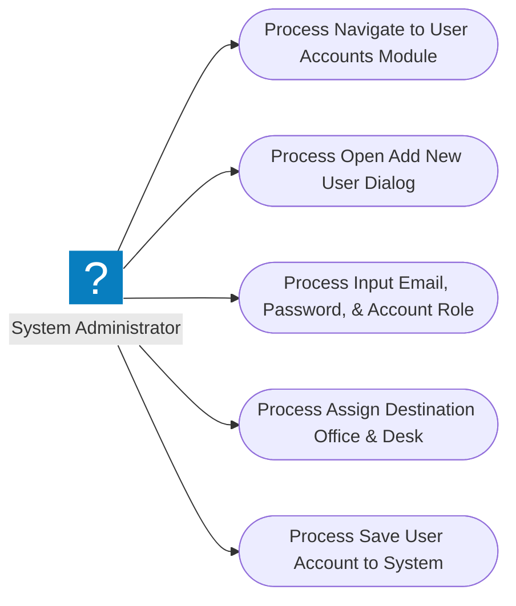
```mermaid
flowchart LR
    Admin@{ icon: "fa-person", label: "System Administrator" }

    P1(["Process Navigate to User Accounts Module"])
    P2(["Process Open Add New User Dialog"])
    P3(["Process Input Email, Password, & Account Role"])
    P4(["Process Assign Destination Office & Desk"])
    P5(["Process Save User Account to System"])

    Admin --> P1
    Admin --> P2
    Admin --> P3
    Admin --> P4
    Admin --> P5
```

### Low-Level (Technical)
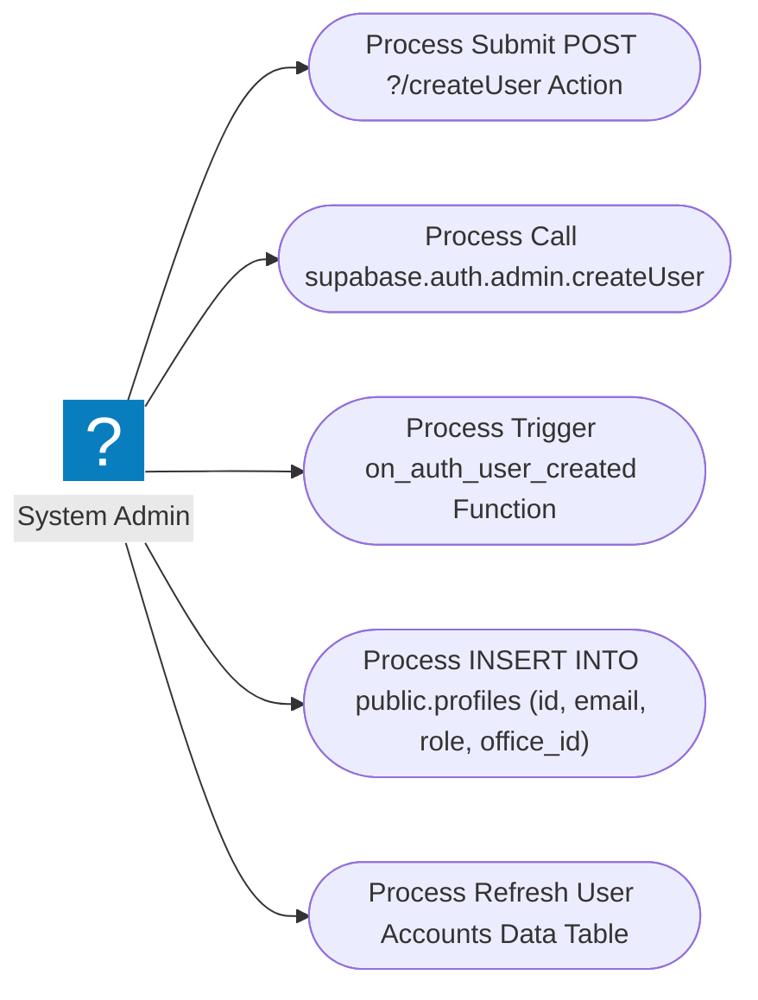
```mermaid
flowchart LR
    Admin@{ icon: "fa-person", label: "System Admin" }

    P1(["Process Submit POST ?/createUser Action"])
    P2(["Process Call supabase.auth.admin.createUser"])
    P3(["Process Trigger on_auth_user_created Function"])
    P4(["Process INSERT INTO public.profiles (id, email, role, office_id)"])
    P5(["Process Refresh User Accounts Data Table"])

    Admin --> P1
    Admin --> P2
    Admin --> P3
    Admin --> P4
    Admin --> P5
```

---

## 6. Use Case Diagram of Admin Updating Roles & Office Assignments

### High-Level (Simplified)
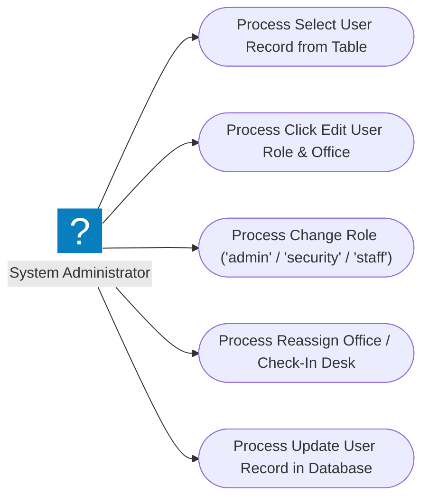
```mermaid
flowchart LR
    Admin@{ icon: "fa-person", label: "System Administrator" }

    P1(["Process Select User Record from Table"])
    P2(["Process Click Edit User Role & Office"])
    P3(["Process Change Role ('admin' / 'security' / 'staff')"])
    P4(["Process Reassign Office / Check-In Desk"])
    P5(["Process Update User Record in Database"])

    Admin --> P1
    Admin --> P2
    Admin --> P3
    Admin --> P4
    Admin --> P5
```

### Low-Level (Technical)
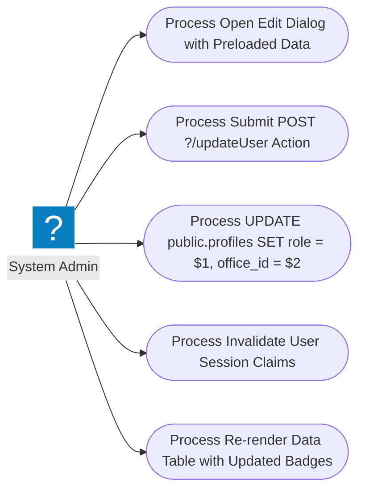
```mermaid
flowchart LR
    Admin@{ icon: "fa-person", label: "System Admin" }

    P1(["Process Open Edit Dialog with Preloaded Data"])
    P2(["Process Submit POST ?/updateUser Action"])
    P3(["Process UPDATE public.profiles SET role = $1, office_id = $2"])
    P4(["Process Invalidate User Session Claims"])
    P5(["Process Re-render Data Table with Updated Badges"])

    Admin --> P1
    Admin --> P2
    Admin --> P3
    Admin --> P4
    Admin --> P5
```

---

## 7. Use Case Diagram of Admin Deleting User Accounts

### High-Level (Simplified)
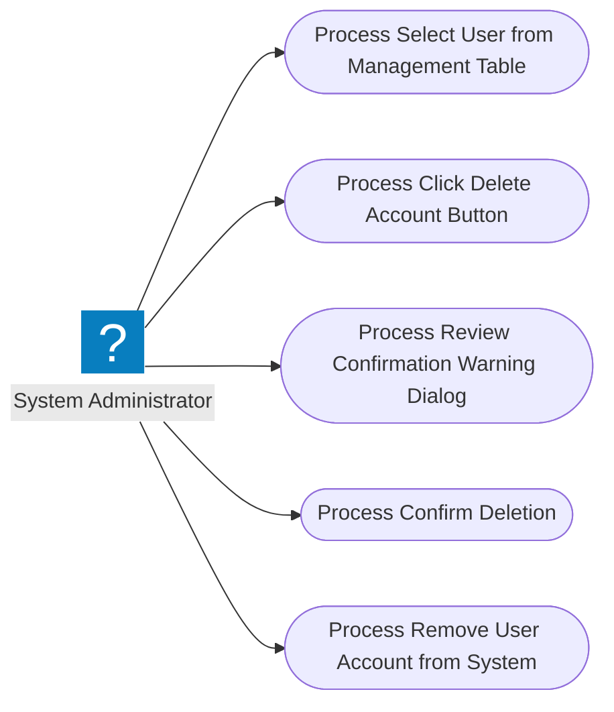
```mermaid
flowchart LR
    Admin@{ icon: "fa-person", label: "System Administrator" }

    P1(["Process Select User from Management Table"])
    P2(["Process Click Delete Account Button"])
    P3(["Process Review Confirmation Warning Dialog"])
    P4(["Process Confirm Deletion"])
    P5(["Process Remove User Account from System"])

    Admin --> P1
    Admin --> P2
    Admin --> P3
    Admin --> P4
    Admin --> P5
```

### Low-Level (Technical)
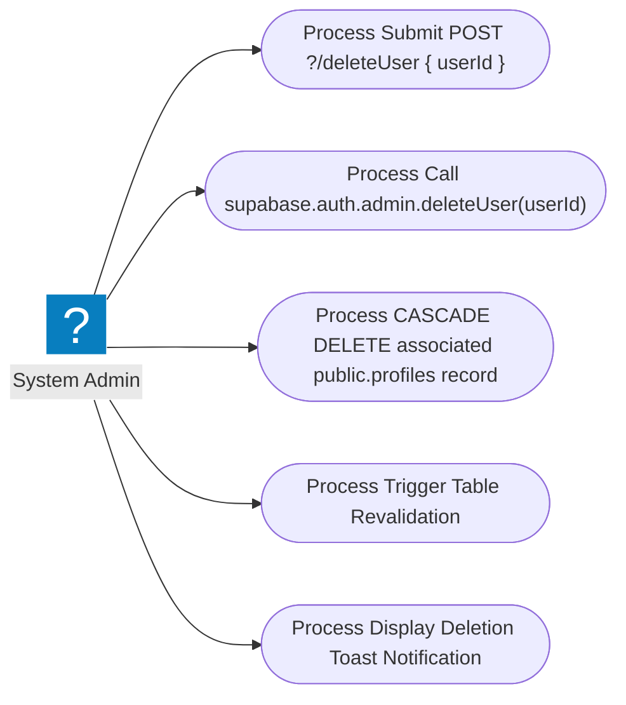
```mermaid
flowchart LR
    Admin@{ icon: "fa-person", label: "System Admin" }

    P1(["Process Submit POST ?/deleteUser { userId }"])
    P2(["Process Call supabase.auth.admin.deleteUser(userId)"])
    P3(["Process CASCADE DELETE associated public.profiles record"])
    P4(["Process Trigger Table Revalidation"])
    P5(["Process Display Deletion Toast Notification"])

    Admin --> P1
    Admin --> P2
    Admin --> P3
    Admin --> P4
    Admin --> P5
```

---

# Module 2: Visitor Gate Registration & Pass Issuance

## 8. Use Case Diagram of 3-Step Visitor Gate Registration

### High-Level (Simplified)
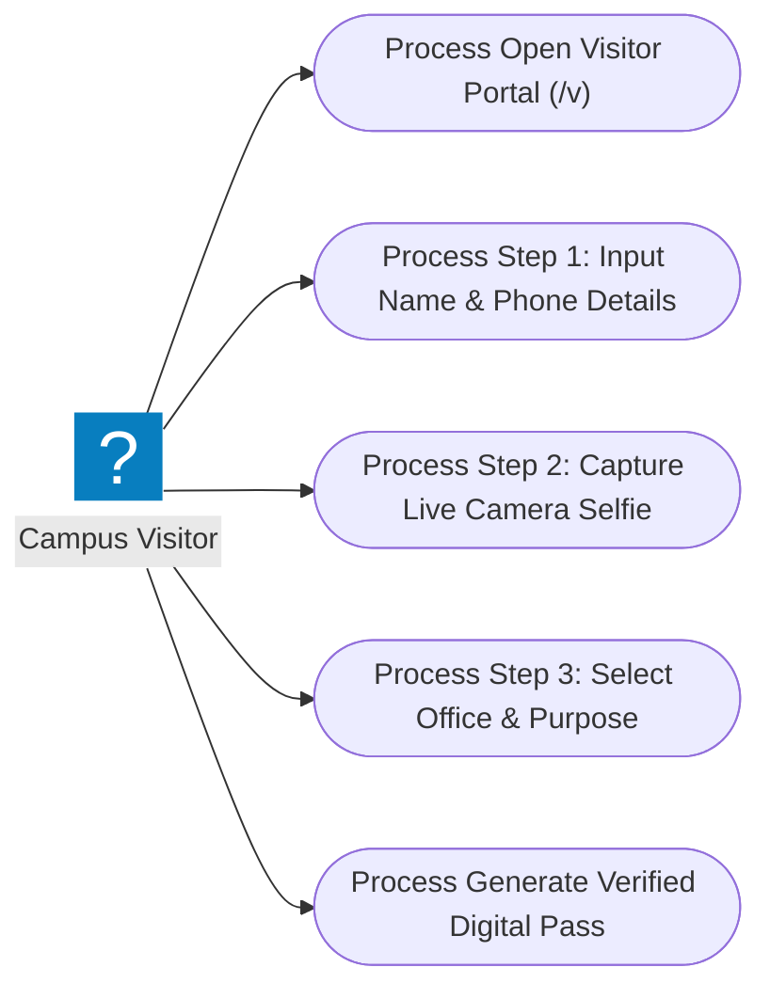
```mermaid
flowchart LR
    Visitor@{ icon: "fa-person", label: "Campus Visitor" }

    P1(["Process Open Visitor Portal (/v)"])
    P2(["Process Step 1: Input Name & Phone Details"])
    P3(["Process Step 2: Capture Live Camera Selfie"])
    P4(["Process Step 3: Select Office & Purpose"])
    P5(["Process Generate Verified Digital Pass"])

    Visitor --> P1
    Visitor --> P2
    Visitor --> P3
    Visitor --> P4
    Visitor --> P5
```

### Low-Level (Technical)
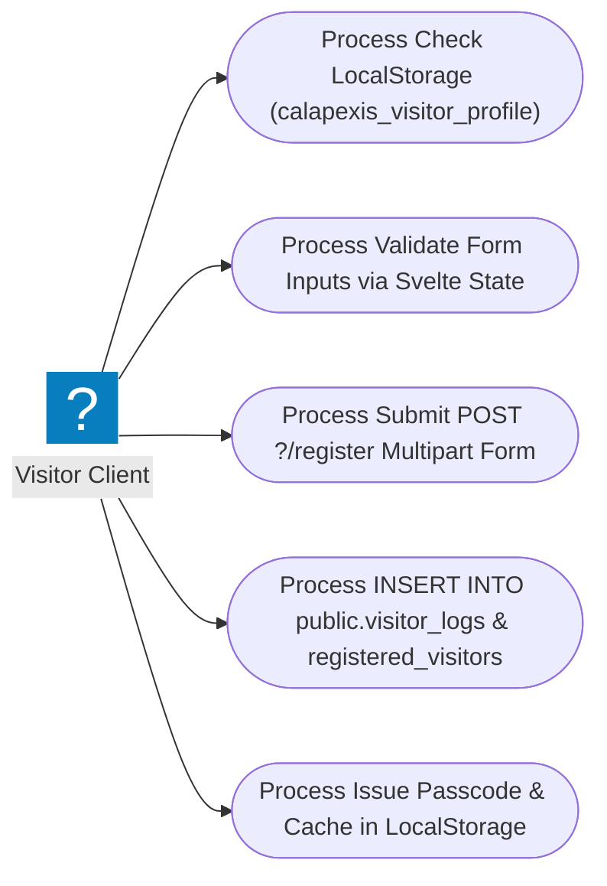
```mermaid
flowchart LR
    Visitor@{ icon: "fa-person", label: "Visitor Client" }

    P1(["Process Check LocalStorage (calapexis_visitor_profile)"])
    P2(["Process Validate Form Inputs via Svelte State"])
    P3(["Process Submit POST ?/register Multipart Form"])
    P4(["Process INSERT INTO public.visitor_logs & registered_visitors"])
    P5(["Process Issue Passcode & Cache in LocalStorage"])

    Visitor --> P1
    Visitor --> P2
    Visitor --> P3
    Visitor --> P4
    Visitor --> P5
```

---

## 9. Use Case Diagram of Capturing Visitor Live Face Selfie

### High-Level (Simplified)
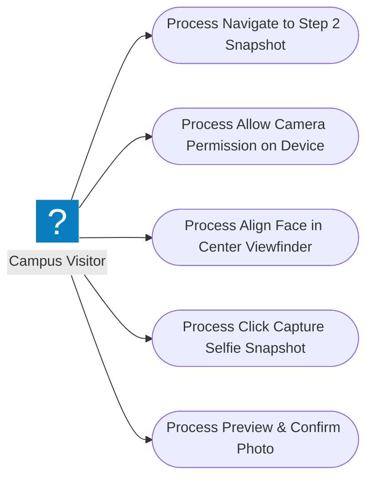
```mermaid
flowchart LR
    Visitor@{ icon: "fa-person", label: "Campus Visitor" }

    P1(["Process Navigate to Step 2 Snapshot"])
    P2(["Process Allow Camera Permission on Device"])
    P3(["Process Align Face in Center Viewfinder"])
    P4(["Process Click Capture Selfie Snapshot"])
    P5(["Process Preview & Confirm Photo"])

    Visitor --> P1
    Visitor --> P2
    Visitor --> P3
    Visitor --> P4
    Visitor --> P5
```

### Low-Level (Technical)
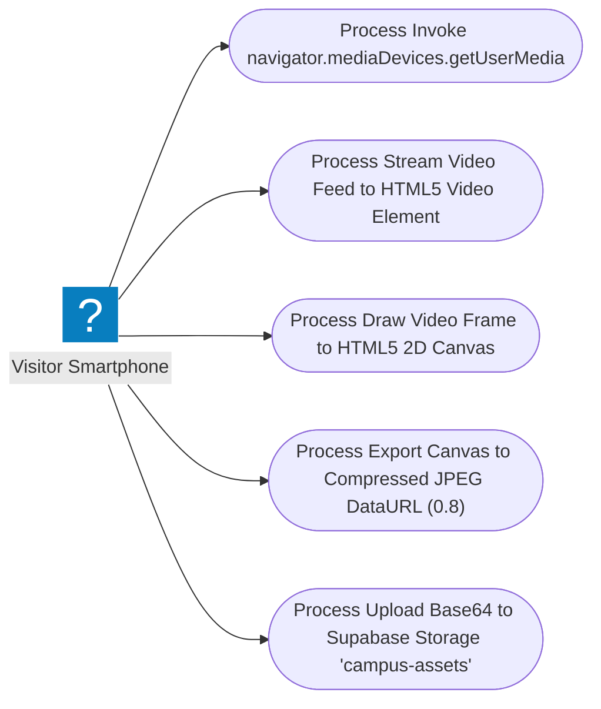
```mermaid
flowchart LR
    Visitor@{ icon: "fa-person", label: "Visitor Smartphone" }

    P1(["Process Invoke navigator.mediaDevices.getUserMedia"])
    P2(["Process Stream Video Feed to HTML5 Video Element"])
    P3(["Process Draw Video Frame to HTML5 2D Canvas"])
    P4(["Process Export Canvas to Compressed JPEG DataURL (0.8)"])
    P5(["Process Upload Base64 to Supabase Storage 'campus-assets'"])

    Visitor --> P1
    Visitor --> P2
    Visitor --> P3
    Visitor --> P4
    Visitor --> P5
```

---

## 10. Use Case Diagram of Visitor Google OAuth Sign-In & Profile Auto-Fill

### High-Level (Simplified)
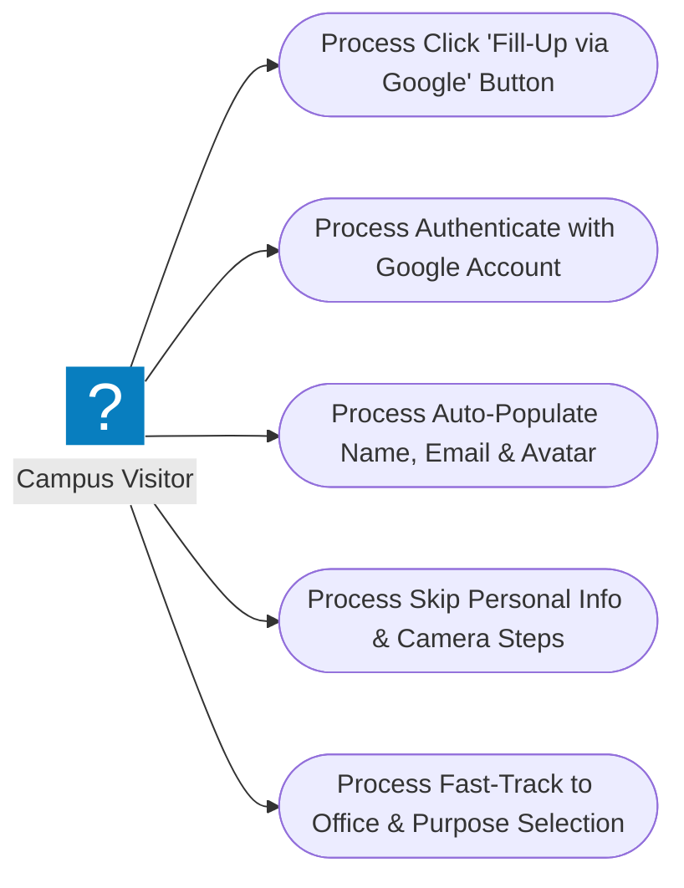
```mermaid
flowchart LR
    Visitor@{ icon: "fa-person", label: "Campus Visitor" }

    P1(["Process Click 'Fill-Up via Google' Button"])
    P2(["Process Authenticate with Google Account"])
    P3(["Process Auto-Populate Name, Email & Avatar"])
    P4(["Process Skip Personal Info & Camera Steps"])
    P5(["Process Fast-Track to Office & Purpose Selection"])

    Visitor --> P1
    Visitor --> P2
    Visitor --> P3
    Visitor --> P4
    Visitor --> P5
```

### Low-Level (Technical)
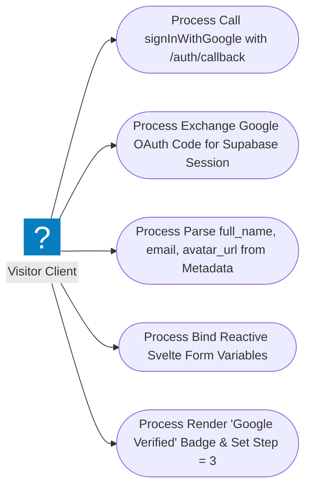
```mermaid
flowchart LR
    Visitor@{ icon: "fa-person", label: "Visitor Client" }

    P1(["Process Call signInWithGoogle with /auth/callback"])
    P2(["Process Exchange Google OAuth Code for Supabase Session"])
    P3(["Process Parse full_name, email, avatar_url from Metadata"])
    P4(["Process Bind Reactive Svelte Form Variables"])
    P5(["Process Render 'Google Verified' Badge & Set Step = 3"])

    Visitor --> P1
    Visitor --> P2
    Visitor --> P3
    Visitor --> P4
    Visitor --> P5
```

---

## 11. Use Case Diagram of Returning Visitor Fast-Track Check-In

### High-Level (Simplified)
```mermaid
flowchart LR
    Visitor@{ icon: "fa-person", label: "Returning Visitor" }

    P1(["Process Open Visitor Portal (/v) on Same Device"])
    P2(["Process Detect Saved Visitor Profile in Storage"])
    P3(["Process Auto-Load Name & Photo Snapshot"])
    P4(["Process Select Destination Office & Purpose"])
    P5(["Process Issue Instant New Visit Pass"])

    Visitor --> P1
    Visitor --> P2
    Visitor --> P3
    Visitor --> P4
    Visitor --> P5
```

### Low-Level (Technical)
```mermaid
flowchart LR
    Visitor@{ icon: "fa-person", label: "Returning Client" }

    P1(["Process Read localStorage(calapexis_visitor_profile)"])
    P2(["Process Bypass Step 1 & Step 2 Wizard Components"])
    P3(["Process Query public.offices for Destination Picker"])
    P4(["Process INSERT INTO public.visitor_logs (visitor_id, office_id)"])
    P5(["Process Update LocalStorage Active Pass Session"])

    Visitor --> P1
    Visitor --> P2
    Visitor --> P3
    Visitor --> P4
    Visitor --> P5
```

---

## 12. Use Case Diagram of Security Gate Pass Verification & Approval

### High-Level (Simplified)
```mermaid
flowchart LR
    Guard@{ icon: "fa-person", label: "Gate Security Guard" }

    P1(["Process Open Gate Command Portal (/dashboard/guard)"])
    P2(["Process View Real-Time Pending Visitor Stream"])
    P3(["Process Inspect Visitor Selfie & Destination"])
    P4(["Process Click Approve Pass Button"])
    P5(["Process Unlock Campus Map on Visitor Smartphone"])

    Guard --> P1
    Guard --> P2
    Guard --> P3
    Guard --> P4
    Guard --> P5
```

### Low-Level (Technical)
```mermaid
flowchart LR
    Guard@{ icon: "fa-person", label: "Gate Guard" }

    P1(["Process Subscribe to Realtime Channel public.visitor_logs"])
    P2(["Process Submit POST ?/approvePass { logId }"])
    P3(["Process UPDATE public.visitor_logs SET verification_status = 'approved'"])
    P4(["Process Broadcast PostgreSQL CDC Update via WebSocket"])
    P5(["Process Trigger Client-Side Map HUD Activation on Visitor Device"])

    Guard --> P1
    Guard --> P2
    Guard --> P3
    Guard --> P4
    Guard --> P5
```

---

## 13. Use Case Diagram of Security Gate Pass Rejection with Reason

### High-Level (Simplified)
```mermaid
flowchart LR
    Guard@{ icon: "fa-person", label: "Gate Security Guard" }

    P1(["Process Inspect Suspicious / Invalid Visitor Pass"])
    P2(["Process Click Reject Pass Button"])
    P3(["Process Input Specific Rejection Reason"])
    P4(["Process Submit Rejection Decision"])
    P5(["Process Notify Visitor with Decline Reason"])

    Guard --> P1
    Guard --> P2
    Guard --> P3
    Guard --> P4
    Guard --> P5
```

### Low-Level (Technical)
```mermaid
flowchart LR
    Guard@{ icon: "fa-person", label: "Gate Guard" }

    P1(["Process Open Rejection Modal Dialog"])
    P2(["Process Submit POST ?/rejectPass { logId, reason }"])
    P3(["Process UPDATE public.visitor_logs SET verification_status = 'rejected'"])
    P4(["Process Broadcast Realtime Payload to Visitor Client"])
    P5(["Process Render 'Pass Declined' UI Card on Visitor Screen"])

    Guard --> P1
    Guard --> P2
    Guard --> P3
    Guard --> P4
    Guard --> P5
```

---

## 14. Use Case Diagram of Issuing Digital Pre-Pass & QR Passcode

### High-Level (Simplified)
```mermaid
flowchart LR
    Visitor@{ icon: "fa-person", label: "Campus Visitor" }

    P1(["Process Complete Gate Registration Form"])
    P2(["Process Receive Unique Passcode (e.g. VIS-4019)"])
    P3(["Process View Digital Pass Badge"])
    P4(["Process Present Passcode to Gate Security"])
    P5(["Process Retain Passcode in Floating Bottom HUD"])

    Visitor --> P1
    Visitor --> P2
    Visitor --> P3
    Visitor --> P4
    Visitor --> P5
```

### Low-Level (Technical)
```mermaid
flowchart LR
    Visitor@{ icon: "fa-person", label: "Visitor Client" }

    P1(["Process Server Generates Unique Alphanumeric Passcode"])
    P2(["Process Store Record in PostgreSQL public.visitor_logs"])
    P3(["Process Render PrePassView Svelte Component"])
    P4(["Process Cache Pass Object in LocalStorage (calapexis_active_pass)"])
    P5(["Process Render QR / Passcode Pill on Map Canvas"])

    Visitor --> P1
    Visitor --> P2
    Visitor --> P3
    Visitor --> P4
    Visitor --> P5
```

---

# Module 3: Office Desk Check-In & Departure Management

## 15. Use Case Diagram of Visitor Office Desk QR Code Check-In

### High-Level (Simplified)
```mermaid
flowchart LR
    Visitor@{ icon: "fa-person", label: "Campus Visitor" }

    P1(["Process Arrive at Assigned Destination Office"])
    P2(["Process Tap 'Scan Office QR Desk' on Map HUD"])
    P3(["Process Point Camera at Office Door QR Code"])
    P4(["Process Match Scanned Code with Destination Office"])
    P5(["Process Confirm Official Check-In Session"])

    Visitor --> P1
    Visitor --> P2
    Visitor --> P3
    Visitor --> P4
    Visitor --> P5
```

### Low-Level (Technical)
```mermaid
flowchart LR
    Visitor@{ icon: "fa-person", label: "Visitor Smartphone" }

    P1(["Process Initialize Html5Qrcode Camera Scanner"])
    P2(["Process Decode Text Payload ('OFF-CCS')"])
    P3(["Process Execute validateScannedOfficeCode Algorithm"])
    P4(["Process Submit POST ?/checkIn { logId, officeCode }"])
    P5(["Process UPDATE public.visitor_logs SET status = 'checked_in', check_in_time = now()"])

    Visitor --> P1
    Visitor --> P2
    Visitor --> P3
    Visitor --> P4
    Visitor --> P5
```

---

## 16. Use Case Diagram of Manual Office Desk Code Fallback Check-In

### High-Level (Simplified)
```mermaid
flowchart LR
    Visitor@{ icon: "fa-person", label: "Campus Visitor" }

    P1(["Process Open Office Check-In Modal"])
    P2(["Process Select Manual Code Fallback Option"])
    P3(["Process Input Printed Office Code (e.g. OFF-REG)"])
    P4(["Process Click Confirm Check-In Button"])
    P5(["Process Activate Checked-In Pass Status"])

    Visitor --> P1
    Visitor --> P2
    Visitor --> P3
    Visitor --> P4
    Visitor --> P5
```

### Low-Level (Technical)
```mermaid
flowchart LR
    Visitor@{ icon: "fa-person", label: "Visitor Client" }

    P1(["Process Render Manual Code Fallback Input Field"])
    P2(["Process Validate Code Format against public.offices"])
    P3(["Process Submit POST ?/checkIn Form Action"])
    P4(["Process Update Log Status & Check-In Timestamp in DB"])
    P5(["Process Switch UI Badge to Active 'CHECKED IN'"])

    Visitor --> P1
    Visitor --> P2
    Visitor --> P3
    Visitor --> P4
    Visitor --> P5
```

---

## 17. Use Case Diagram of Visitor Self Check-Out via Mobile HUD

### High-Level (Simplified)
```mermaid
flowchart LR
    Visitor@{ icon: "fa-person", label: "Campus Visitor" }

    P1(["Process Conclude Campus Visit / Appointment"])
    P2(["Process Click 'Check Out' Button on Bottom HUD"])
    P3(["Process Confirm Departure Prompt"])
    P4(["Process Record Departure Timestamp in Database"])
    P5(["Process Clear Active Pass from Device"])

    Visitor --> P1
    Visitor --> P2
    Visitor --> P3
    Visitor --> P4
    Visitor --> P5
```

### Low-Level (Technical)
```mermaid
flowchart LR
    Visitor@{ icon: "fa-person", label: "Visitor Client" }

    P1(["Process Trigger POST ?/checkout { logId } Action"])
    P2(["Process UPDATE public.visitor_logs SET status = 'checked_out', check_out_time = now()"])
    P3(["Process Remove calapexis_active_pass from LocalStorage"])
    P4(["Process Reset Reactive Pass State in Svelte Store"])
    P5(["Process Re-render Gate Registration Overlay Modal"])

    Visitor --> P1
    Visitor --> P2
    Visitor --> P3
    Visitor --> P4
    Visitor --> P5
```

---

## 18. Use Case Diagram of Staff / Guard Manual Check-Out

### High-Level (Simplified)
```mermaid
flowchart LR
    Staff@{ icon: "fa-person", label: "Office Staff / Security" }

    P1(["Process Open Visitor Logbook Table (/dashboard/logs)"])
    P2(["Process Locate Active Visitor Record"])
    P3(["Process Click Manual Check-Out Action Button"])
    P4(["Process Save Departure Time to System"])
    P5(["Process Update Status to 'checked_out'"])

    Staff --> P1
    Staff --> P2
    Staff --> P3
    Staff --> P4
    Staff --> P5
```

### Low-Level (Technical)
```mermaid
flowchart LR
    Staff@{ icon: "fa-person", label: "Staff Actor" }

    P1(["Process Submit POST ?/checkout { logId } from Data Table"])
    P2(["Process Execute PostgreSQL UPDATE on public.visitor_logs"])
    P3(["Process Broadcast Realtime WebSocket Update"])
    P4(["Process Invalidate SvelteKit Load Cache"])
    P5(["Process Re-render Table Row with Completed Check-Out Time"])

    Staff --> P1
    Staff --> P2
    Staff --> P3
    Staff --> P4
    Staff --> P5
```

---

## 19. Use Case Diagram of Automated Scheduled Nightly Check-Out

### High-Level (Simplified)
```mermaid
flowchart LR
    System@{ icon: "fa-person", label: "Automated Scheduler" }

    P1(["Process Trigger Nightly Maintenance Routine (11:59 PM)"])
    P2(["Process Query Unresolved 'checked_in' Visitor Sessions"])
    P3(["Process Set Departure Timestamp to End of Day"])
    P4(["Process Mark Session Status as 'checked_out'"])
    P5(["Process Archive Day's Logbook Sessions"])

    System --> P1
    System --> P2
    System --> P3
    System --> P4
    System --> P5
```

### Low-Level (Technical)
```mermaid
flowchart LR
    System@{ icon: "fa-person", label: "PostgreSQL pg_cron" }

    P1(["Process Execute Cron Job '0 0 * * *'"])
    P2(["Process Invoke public.auto_checkout_unresolved_visitors()"])
    P3(["Process UPDATE public.visitor_logs SET status = 'checked_out', check_out_time = now() WHERE status = 'checked_in'"])
    P4(["Process Invalidate Active Sessions across Subscriptions"])
    P5(["Process Write Execution Log to Database Telemetry"])

    System --> P1
    System --> P2
    System --> P3
    System --> P4
    System --> P5
```

---

# Module 4: Interactive Campus Map & GPS Navigation

## 20. Use Case Diagram of Campus Map Exploration & 3D Layer Toggle

### High-Level (Simplified)
```mermaid
flowchart LR
    Visitor@{ icon: "fa-person", label: "Campus Visitor" }

    P1(["Process Open Interactive Campus Map"])
    P2(["Process Pan & Zoom Campus Map Canvas"])
    P3(["Process Toggle Map Layers (OSM / Satellite / 3D Image Overlay)"])
    P4(["Process Click Landmark Pin for Details"])
    P5(["Process View Building Floor Count & Directory"])

    Visitor --> P1
    Visitor --> P2
    Visitor --> P3
    Visitor --> P4
    Visitor --> P5
```

### Low-Level (Technical)
```mermaid
flowchart LR
    Visitor@{ icon: "fa-person", label: "Leaflet Client" }

    P1(["Process Initialize L.map with Custom Bounds"])
    P2(["Process Load L.tileLayer (OpenStreetMap / Esri World Imagery)"])
    P3(["Process Render L.imageOverlay for Campus 3D Graphic"])
    P4(["Process Bind Custom Marker Popups from public.buildings"])
    P5(["Process Handle window.resize & leaflet.invalidateSize()"])

    Visitor --> P1
    Visitor --> P2
    Visitor --> P3
    Visitor --> P4
    Visitor --> P5
```

---

## 21. Use Case Diagram of Real-Time GPS Tracking & Compass Orientation

### High-Level (Simplified)
```mermaid
flowchart LR
    Visitor@{ icon: "fa-person", label: "Campus Visitor" }

    P1(["Process Enable Device Location Services"])
    P2(["Process Track Live GPS Coordinates on Map"])
    P3(["Process View Pulsing Blue Location Dot"])
    P4(["Process Rotate Phone to Align Compass Heading"])
    P5(["Process Recenter Map to Current Location"])

    Visitor --> P1
    Visitor --> P2
    Visitor --> P3
    Visitor --> P4
    Visitor --> P5
```

### Low-Level (Technical)
```mermaid
flowchart LR
    Visitor@{ icon: "fa-person", label: "Device Sensors" }

    P1(["Process Call navigator.geolocation.watchPosition"])
    P2(["Process Listen to window.DeviceOrientationEvent (Alpha Bearing)"])
    P3(["Process Update Leaflet Custom DivIcon Position"])
    P4(["Process Apply CSS Transform Rotate on Compass Pointer"])
    P5(["Process Fallback to Campus Main Gate Coordinates if Denied"])

    Visitor --> P1
    Visitor --> P2
    Visitor --> P3
    Visitor --> P4
    Visitor --> P5
```

---

## 22. Use Case Diagram of Dijkstra Campus Pathfinding & ETA Calculation

### High-Level (Simplified)
```mermaid
flowchart LR
    Visitor@{ icon: "fa-person", label: "Campus Visitor" }

    P1(["Process Select Target Building / Office Destination"])
    P2(["Process Calculate Shortest Walking Route"])
    P3(["Process Display Route Polyline on Campus Map"])
    P4(["Process View Total Walking Distance in Meters"])
    P5(["Process View Estimated Walking Time (ETA)"])

    Visitor --> P1
    Visitor --> P2
    Visitor --> P3
    Visitor --> P4
    Visitor --> P5
```

### Low-Level (Technical)
```mermaid
flowchart LR
    Visitor@{ icon: "fa-person", label: "Path Engine" }

    P1(["Process Fetch public.map_edges GeoJSON Waypoints"])
    P2(["Process Construct Weighted Adjacency Graph"])
    P3(["Process Execute Dijkstra Shortest Path Algorithm"])
    P4(["Process Calculate Metric Distance & Walking Minutes"])
    P5(["Process Draw L.polyline with #2563eb on Leaflet Canvas"])

    Visitor --> P1
    Visitor --> P2
    Visitor --> P3
    Visitor --> P4
    Visitor --> P5
```

---

## 23. Use Case Diagram of Searching Campus Landmarks & Office Desks

### High-Level (Simplified)
```mermaid
flowchart LR
    Visitor@{ icon: "fa-person", label: "Campus Visitor" }

    P1(["Process Tap Top Search Bar on Map"])
    P2(["Process Type Building, Room, or Office Name"])
    P3(["Process View Instant Filtered Search Suggestions"])
    P4(["Process Select Desired Destination Item"])
    P5(["Process Automatically Pan Map & Focus Landmark"])

    Visitor --> P1
    Visitor --> P2
    Visitor --> P3
    Visitor --> P4
    Visitor --> P5
```

### Low-Level (Technical)
```mermaid
flowchart LR
    Visitor@{ icon: "fa-person", label: "Search Component" }

    P1(["Process Bind Input Value to Svelte Reactive Query"])
    P2(["Process Filter in-memory Building, Room, & Office Arrays"])
    P3(["Process Render Responsive Dropdown Result Cards"])
    P4(["Process Trigger leafMap.flyTo(coordinates, zoomLevel)"])
    P5(["Process Auto-Trigger Dijkstra Path Calculation to Destination"])

    Visitor --> P1
    Visitor --> P2
    Visitor --> P3
    Visitor --> P4
    Visitor --> P5
```

---

# Module 5: Infrastructure & Audit Reporting

## 24. Use Case Diagram of Admin Managing Buildings, Rooms & Offices

### High-Level (Simplified)
```mermaid
flowchart LR
    Admin@{ icon: "fa-person", label: "System Administrator" }

    P1(["Process Open Infrastructure Management Module"])
    P2(["Process Add / Edit Campus Buildings & Upload Photos"])
    P3(["Process Configure Rooms, Numbers & Floor Levels"])
    P4(["Process Register Department Offices & Bind to Rooms"])
    P5(["Process Persist Infrastructure to Database"])

    Admin --> P1
    Admin --> P2
    Admin --> P3
    Admin --> P4
    Admin --> P5
```

### Low-Level (Technical)
```mermaid
flowchart LR
    Admin@{ icon: "fa-person", label: "System Admin" }

    P1(["Process Upload Landmark Photos to Supabase Storage"])
    P2(["Process POST ?/upsertBuilding to public.buildings"])
    P3(["Process POST ?/upsertRoom to public.rooms"])
    P4(["Process POST ?/upsertOffice to public.offices"])
    P5(["Process Invalidate Infrastructure Cache & Update Map Pins"])

    Admin --> P1
    Admin --> P2
    Admin --> P3
    Admin --> P4
    Admin --> P5
```

---

## 25. Use Case Diagram of Admin Configuring & Drawing Map Pathway Edges

### High-Level (Simplified)
```mermaid
flowchart LR
    Admin@{ icon: "fa-person", label: "System Administrator" }

    P1(["Process Open Visual Map Edge Canvas"])
    P2(["Process Select Start Building & Destination Building"])
    P3(["Process Click along Campus Walkway to Plot Points"])
    P4(["Process Drag Vertex Markers to Fine-Tune Position"])
    P5(["Process Save Pathway Edge to System Graph"])

    Admin --> P1
    Admin --> P2
    Admin --> P3
    Admin --> P4
    Admin --> P5
```

### Low-Level (Technical)
```mermaid
flowchart LR
    Admin@{ icon: "fa-person", label: "System Admin" }

    P1(["Process Listen to Leaflet Map Click Events"])
    P2(["Process Append [lat, lng] to Reactive Waypoints Array"])
    P3(["Process Render Draggable L.marker Instances on Vertices"])
    P4(["Process Submit POST ?/saveEdge { from_node, to_node, path: JSON }"])
    P5(["Process INSERT INTO public.map_edges (from_node, to_node, path)"])

    Admin --> P1
    Admin --> P2
    Admin --> P3
    Admin --> P4
    Admin --> P5
```

---

## 26. Use Case Diagram of Generating & Exporting Print Audit Reports

### High-Level (Simplified)
```mermaid
flowchart LR
    User@{ icon: "fa-person", label: "Admin / Office Staff" }

    P1(["Process Navigate to Visitor Logbook Module"])
    P2(["Process Filter by Date Range, Office & Verification"])
    P3(["Process Click 'Print Audit Report' Button"])
    P4(["Process Preview Letterhead Document Grouped by Date"])
    P5(["Process Export Official PDF or Print Document"])

    User --> P1
    User --> P2
    User --> P3
    User --> P4
    User --> P5
```

### Low-Level (Technical)
```mermaid
flowchart LR
    User@{ icon: "fa-person", label: "Reporting Engine" }

    P1(["Process Query public.visitor_logs with Role-Scoped Filters"])
    P2(["Process Execute generatePrintableReportHTML(filteredVisitors)"])
    P3(["Process Inject BISU Calape Seal, Letterhead, & Table CSS"])
    P4(["Process Open Isolated Standalone Window (window.open)"])
    P5(["Process Invoke printWin.print() for Native System PDF Dialog"])

    User --> P1
    User --> P2
    User --> P3
    User --> P4
    User --> P5
```
